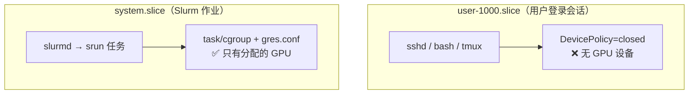
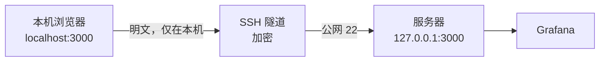

# 访问入口与安全加固

这篇解决一个具体问题：**用户能 SSH 登录、能编辑代码，但用 GPU 必须经过 Slurm。**

听起来简单，但 `--gres=gpu:1` 只告诉调度器「我申请 1 张卡」，
**它本身不阻止程序去碰另外 7 张卡**。真正的约束必须落在内核的设备访问控制上。

## 威胁模型

这里要防的是**无意的资源争抢**：

| 场景 | 后果 |
|---|---|
| 用户在 SSH 终端直接 `python train.py` | Slurm 不知道这张卡被占用，可能把它再分配给别人的任务 |
| 用户用 `tmux` 挂一个脚本长期跑 | 卡被锁住但 `squeue` 里看不到，管理员无法定位 |
| 用户写 `crontab` 定时占卡 | 同上，而且重启后依然存在 |
| 用户互相看到对方的进程 | 隐私与误杀风险 |

!!! info "目的：保护调度记录的可信度"
    只要「`squeue` 显示的占用」和「真实的 GPU 占用」不一致，
    调度器就会做出错误决策，最后受害的是所有按时提交任务的用户。

同时必须保证：

* ✅ 普通用户能 SSH 登录
* ✅ 能编辑代码、装环境、传数据
* ✅ `srun` / `sbatch` / `salloc` 提交的任务**能正常拿到卡**
* ✅ root 保留完整维护权限

## 方案选型

### 为什么不用 `pam_slurm_adopt`

`pam_slurm_adopt` 是 Slurm 官方推荐的方案：通过 PAM 把用户的 SSH 会话
「收养」到他的 Slurm 作业 cgroup 里。没在跑任务的用户**根本不允许登录**。

!!! danger "它不适合这台机器"
    `TenseiNode1` **同时是登录节点和计算节点**。
    `pam_slurm_adopt` 会让「没有运行任务的用户」无法 SSH 登录 ——
    而用户正是要先登录才能提交任务。这形成了死锁。

    正确做法是把登录节点与计算节点分开，在计算节点上用 `pam_slurm_adopt`。
    单机阶段不适用。

### 采用的方案：用户 slice 的设备访问限制

systemd 会为每个登录用户创建一个 `user-<UID>.slice` cgroup。
把它的设备策略设为 `closed`，用户会话就**只能访问标准伪设备**
（终端、`/dev/null` 等），无法打开 `/dev/nvidia*`。



**关键点：Slurm 作业在另一条 cgroup 分支（`system.slice/slurmd.service`）下，
不继承用户 slice 的限制。** 所以「用户会话被限制」与「Slurm 任务能用卡」
两者不冲突。

| 特性 | 说明 |
|---|---|
| 生效范围 | 只影响该 UID 的登录会话 |
| 持久性 | systemd 保存在 `/etc/systemd/system/user-*.slice.d/`，重启仍生效 |
| 用户体验 | `nvidia-smi` 报 `Failed to initialize NVML: Unknown Error` |
| 可回滚 | 一条 `systemctl set-property ... DevicePolicy=auto` |
| 对 root 影响 | 无，root 不受用户 slice 限制 |

!!! note "为什么用户看到的不是「命令不存在」"
    有些集群通过在普通用户的 `PATH` 里去掉 `nvidia-smi` 来达到类似效果，
    表现是 `command not found`。

    本方案限制的是**设备节点**，`nvidia-smi` 二进制还在，
    所以报的是 NVML 初始化失败。**两者效果等价**，
    但设备级限制更彻底 —— 用户即使自己编译一个 CUDA 程序也拿不到卡。

## 前置审计

下发限制前，先确认现状：用户没有 sudo、会话确实在用户 slice 下、
Slurm 作业在系统 slice 下。

```bash
# 用户权限：是否存在能绕过限制的管理员权限
id chao
id wzixuan
sudo -l -U chao
sudo -l -U wzixuan

# 用户会话与 Slurm 服务所在的 cgroup
loginctl list-sessions

systemctl show \
  user-1000.slice user-1001.slice slurmd.service \
  -p Id -p ActiveState -p ControlGroup -p DevicePolicy

ps -eo user,pid,cgroup,comm \
  | grep -E 'sshd|slurm|bash|zsh|tmux|screen|cron'

# 确认 Slurm 作业内部的设备隔离仍开启
cat /etc/slurm/cgroup.conf
```

预期看到：

```text
User chao is not allowed to run sudo on TenseiNode1.
ControlGroup=/user.slice/user-1000.slice
DevicePolicy=auto
ControlGroup=/system.slice/slurmd.service
slurm    2218464 0::/system.slice/slurmctld. slurmctld
CgroupPlugin=cgroup/v2
ConstrainDevices=yes
```

!!! danger "任何用户有 sudo 权限都会让限制失效"
    `sudo` 能让用户切到 root，绕过所有设备限制。
    如果审计发现普通用户在 `sudo` 组里，**先处理这个问题**。

## 下发限制

```bash
(
set -e

systemctl set-property user-1000.slice \
  DevicePolicy=closed DeviceAllow=

systemctl set-property user-1001.slice \
  DevicePolicy=closed DeviceAllow=

systemctl show user-1000.slice user-1001.slice \
  -p Id -p DevicePolicy -p DeviceAllow
)
```

预期输出：

```text
DevicePolicy=closed
DeviceAllow=
```

!!! warning "UID 必须与实际用户对应"
    这里写死的是 `chao`(1000) 和 `wzixuan`(1001)。
    **新用户创建后必须同样下发限制**，否则新账号不受约束。
    这正是 [`tensei-add-user`](users.md) 脚本要自动做这件事的原因。

### 验证

让用户在**真实 SSH 会话**中执行（`sudo` 与 `runuser` 都无法复现该限制）：

```bash
whoami
cat /proc/self/cgroup
nvidia-smi -L
```

预期：

```text
chao
0::/user.slice/user-1000.slice/session-355.scope
Failed to initialize NVML: Unknown Error
```

再验证 Slurm 任务**仍然可以**用卡：

```bash
srun -A research -p gpu \
  --immediate=10 \
  --gres=gpu:1 -N1 -n1 \
  --cpus-per-task=1 --mem=1G --time=00:01:00 \
  bash -c 'cat /proc/self/cgroup; nvidia-smi -L'
```

预期：

```text
GPU 0: NVIDIA A100-SXM4-80GB (UUID: GPU-a0276972-3de5-c07b-0c2f-bcc0084566b7)
```

!!! success "这一对结果就是验收标准"
    * 裸会话：`NVML: Unknown Error` —— 限制生效
    * Slurm 任务：恰好一张 A100 —— 调度正常

    两者同时成立，加固才算成功。

### 回滚

如果限制影响了正常使用：

```bash
systemctl set-property user-1000.slice DevicePolicy=auto DeviceAllow=
systemctl set-property user-1001.slice DevicePolicy=auto DeviceAllow=
```

!!! note "root、DCGM、Grafana 都不受影响"
    它们运行在 `system.slice` 下。
    下发限制后监控栈仍能正常采集 8 张卡。

## 封堵其他绕过入口

设备限制只覆盖 systemd 管理的**用户会话**。其他能启动进程的入口要单独处理。

| 入口 | 风险 | 措施 |
|---|---|---|
| `crontab` 定时任务 | 定时任务也在用户会话中，但用户可能用它长期占卡 | `/etc/cron.allow` 只允许 root |
| `at` 延时任务 | 同上 | `/etc/at.allow` 只允许 root |
| 网页终端（Cockpit / OOD） | 属于登录会话，已被设备限制覆盖 | 确认其 PAM 会话走 `common-session` |
| 常驻用户服务 | `systemd --user` 也在用户 slice 下 | 已被设备限制覆盖 |
| 已启用的 Web 应用 | Apache 等若以用户身份启动进程 | 停用不需要的服务 |

```bash
(
set -e

# 仅允许 root 管理 cron、at 任务
printf 'root\n' > /etc/cron.allow
printf 'root\n' > /etc/at.allow
chown root:root /etc/cron.allow /etc/at.allow
chmod 644 /etc/cron.allow /etc/at.allow

# 关闭暂未使用的 Open OnDemand 入口
a2dissite ood-portal
systemctl disable --now apache2

echo "ENTRY RESTRICTIONS OK"
)
```

验证：

```bash
runuser -u chao -- crontab -l
runuser -u wzixuan -- crontab -l
systemctl is-active apache2
command -v atq >/dev/null && atq
```

预期普通用户会看到 `You (chao) are not allowed to use this program`。

!!! note "确认 PAM 会话配置"
    `cron`、`sshd`、`cockpit` 都应该 include `common-session`，
    这样 `pam_systemd` 才会把进程放进用户 slice：

    ```bash
    grep -HnE 'pam_systemd|common-session' \
      /etc/pam.d/cron \
      /etc/pam.d/sshd \
      /etc/pam.d/cockpit \
      /etc/pam.d/common-session \
      /etc/pam.d/common-session-noninteractive 2>/dev/null
    ```

    预期看到 `session optional pam_systemd.so` 出现在 `common-session` 中。

!!! tip "定期复查绕过入口"
    新增服务时可能引入新的进程启动路径。
    建议定期检查用户进程的实际 cgroup：

    ```bash
    ps -ww -u chao,wzixuan -o user,pid,cgroup:120,comm
    ```

    如果出现不属于 `user-<UID>.slice` 的用户进程，就要单独评估。

## SSH 与防火墙

| 端口 | 是否开放 | 说明 |
|---|---|---|
| `22` (SSH) | ✅ **唯一开放** | 所有管理的入口 |
| `80` / `443` | ❌ | Open OnDemand 已停用 |
| `3000` (Grafana) | ❌ | 走 SSH 隧道 |
| `9090` (Cockpit) | ❌ | 走 SSH 隧道 |
| `9091` (Prometheus) | ❌ | 本机抓取 |
| `6817` / `6819` | ❌ **绝不可开放** | Slurm 控制与记账端口 |
| `3306` (MariaDB) | ❌ **绝不可开放** | 数据库 |

!!! danger "`6817` / `6819` / `3306` 暴露到公网等于交出集群"
    任何人连上 `6817` 就能提交任务；连上 `3306` 就能读取或篡改全部记账数据。
    这三个端口必须只监听 `127.0.0.1` 或被防火墙完全阻断。

顺便检查监听状态，确认没有服务意外绑定到 `0.0.0.0`：

```bash
ss -lntp
```

!!! warning "注意 `slurmdbd` 的监听地址"
    如果发现 `slurmdbd` 监听在 `0.0.0.0:6819`，
    用 `DbdAddr=127.0.0.1` 限定，或在安全组/iptables 层阻断。

## 通过 SSH 隧道访问面板

Grafana、Cockpit 都只监听 `127.0.0.1`，安全组也只放行 `22`。
管理员要用浏览器打开它们，走 SSH 隧道即可，**不需要额外开放端口或申请证书**。

### 为什么不直接把面板暴露出去

* **安全**：面板的登录页暴露在公网会持续被扫描和爆破；
* **证书**：用 IP 访问申请不到受信任的 HTTPS 证书，浏览器会一直告警。

隧道把远程端口映射到本机，流量全程由 SSH 加密。



### 方式一：Xshell 配置隧道

打开服务器会话的 **属性 → 连接 → SSH → 隧道**，添加以下规则：

| 配置项 | Grafana 监控 | Cockpit 管理 |
|---|---|---|
| 类型 | Local（本地） | Local（本地） |
| 本地监听地址 | `127.0.0.1` | `127.0.0.1` |
| 本地端口 | `3000` | `9090` |
| 目标主机 | `127.0.0.1` | `127.0.0.1` |
| 目标端口 | `3000` | `9090` |

保存后**重新连接** SSH，隧道即生效。访问期间保持 Xshell 会话连接，会话断开则隧道失效。

!!! danger "「目标主机」指服务器自身"
    它指的是「从服务器看过去要连哪里」，所以填 `127.0.0.1`，
    **不是**你 Windows 电脑的地址。这是配置隧道最容易搞错的一点。

### 方式二：命令行隧道

```bash
# 一条命令同时转发 Grafana 和 Cockpit
ssh -N \
  -L 3000:127.0.0.1:3000 \
  -L 9090:127.0.0.1:9090 \
  zhangsan@SERVER_IP
```

| 参数 | 作用 |
|---|---|
| `-N` | 只建立隧道，不开远程 shell |
| `-L 本地端口:目标主机:目标端口` | 把本机端口转发到服务器上的目标地址 |
| `-f` | （可选）让隧道转到后台运行 |

也可以写进 `~/.ssh/config`，之后一条 `ssh tensei-tunnel` 就能建立：

```text
Host tensei-tunnel
    HostName SERVER_IP
    User zhangsan
    LocalForward 3000 127.0.0.1:3000
    LocalForward 9090 127.0.0.1:9090
    ExitOnForwardFailure yes
```

### 访问地址

| 页面 | 本机浏览器地址 | 登录方式 | 用途 |
|---|---|---|---|
| Grafana 监控 | `http://localhost:3000` | Grafana 独立账号 | GPU 用量统计、实时占用、用户与任务对应 |
| Cockpit 管理 | `https://localhost:9090` | 服务器 Linux 账号 | 服务状态、日志、系统资源 |

!!! note "Grafana 账号与 Linux 账号是两套"
    Grafana 有独立的用户体系，SSH 能登录**不代表**能登录 Grafana。
    需要给谁开看板权限时，在 Grafana 的 **Administration → Users** 里添加。

!!! warning "Cockpit 提示证书不受信任"
    这是自签名证书的正常提示。确认地址是 `https://localhost:9090`、且隧道目标正确后，
    选择继续访问即可。

!!! note "HTTP 会不会不安全"
    Grafana 使用的是 HTTP，但浏览器连接的是**本机的隧道入口**，
    从本机到服务器这段链路由 SSH 加密，公网上传输的是密文。

!!! tip "本地端口被占用时"
    改本地端口，目标端口保持不变：

    ```bash
    ssh -N -L 13000:127.0.0.1:3000 zhangsan@SERVER_IP
    # 浏览器改用 http://localhost:13000
    ```

!!! warning "面板入口不面向普通用户"
    普通用户只需要 SSH 和 Slurm 命令，文档里不介绍隧道配置。
    确实要给某个人开 Grafana 账号时，只给 Viewer 权限，
    并说明看板中的用量数据对全部有权限的人可见。

## Cockpit：管理员面板

Cockpit 提供网页版的服务管理、日志查看和终端，**仅供管理员使用**。

```bash
apt-get install -t jammy-backports --no-install-recommends cockpit
```

!!! note "从 backports 装是为了拿到较新版本"
    `jammy-backports` 里的 Cockpit 版本比主源新，功能更完整。

限定只监听本机：

```bash
mkdir -p /etc/systemd/system/cockpit.socket.d

cat > /etc/systemd/system/cockpit.socket.d/listen.conf <<'EOF'
[Socket]
ListenStream=
ListenStream=127.0.0.1:9090
EOF

systemctl daemon-reload
systemctl enable cockpit.socket
systemctl restart cockpit.socket
```

```bash
systemctl status cockpit.socket --no-pager -l
ss -lntp 'sport = :9090'
```

预期 `active (listening)` 且绑定 `127.0.0.1:9090`。

**访问方式**：建好 SSH 隧道后打开 `https://localhost:9090`，
用**服务器 Linux 账号**登录（不是 SSH 私钥）。

!!! danger "Cockpit 是完整的管理面板"
    它能启动/停止服务、看日志、开终端。
    **绝对不要给普通用户 Cockpit 访问权限**，也不要暴露到公网。

!!! warning "Cockpit 创建用户不会自动配置 Slurm"
    在 Cockpit 里建 Linux 用户**不会**同时创建 Slurm 记账关联，
    **也不会**下发 GPU 设备限制。开户必须走
    [`tensei-add-user`](users.md)。

| 需求 | 用什么工具 |
|---|---|
| 看服务状态与日志 | **Cockpit** |
| 创建 Linux 用户 | `tensei-add-user` |
| 设置 GPU 配额、时限 | [SlurmDBD + `sacctmgr`](accounting.md) |

## Open OnDemand：网页提交任务（当前暂停）

!!! warning "当前状态：已安装但停用"
    OOD 4.1.7 已装好并接入了 Slurm，但在会话中被暂停并关闭
    （`a2dissite ood-portal` + `systemctl disable --now apache2`）。
    当前用户入口只有 **Grafana（监控）** 与 **Cockpit（管理员）**。

如果后续要重新启用，以下是当时的配置要点。

### 版本选择

Ubuntu 22.04 对应 OOD 的 **4.1 分支**（4.2 已不支持 22.04）。

```bash
cd /root
apt-get install -y apt-transport-https ca-certificates curl

curl -fL --retry 3 \
  -o /tmp/ondemand-release-web_4.1.0-jammy_all.deb \
  https://apt.osc.edu/ondemand/4.1/ondemand-release-web_4.1.0-jammy_all.deb

apt-get install /tmp/ondemand-release-web_4.1.0-jammy_all.deb
apt-get update

apt-get install ondemand
```

!!! warning "OSC 源不能换成国内镜像"
    Open OnDemand 用的是 `apt.osc.edu` 专用源，
    **清华、阿里等 Ubuntu 镜像里没有这个包**。
    下载慢时只能走「本机下载 `.deb` → 上传 → `apt-get --no-download install`」的路径，
    方法与 [Grafana 安装](monitoring.md#安装-grafana)完全一样。

### 接入 Slurm

```bash
install -d -m 0755 /etc/ood/config/clusters.d

cat > /etc/ood/config/clusters.d/tensei.yml <<'EOF'
---
v2:
  metadata:
    title: "Tensei A100 Cluster"
  login:
    host: "TenseiNode1"
  job:
    adapter: "slurm"
    bin: "/usr/bin"
    conf: "/etc/slurm/slurm.conf"
    copy_environment: false
EOF

chmod 644 /etc/ood/config/clusters.d/tensei.yml
```

| 字段 | 含义 |
|---|---|
| `login.host` | 用户从网页开终端时登录到哪台机器 |
| `job.adapter: slurm` | 用 Slurm 作为作业后端 |
| `job.conf` | `slurm.conf` 路径，OOD 靠它读取队列与节点信息 |
| `copy_environment: false` | 不复制 Web 服务的环境变量到任务，避免污染 |

!!! note "单集群不要写 `cluster:` 字段"
    写了会引入多集群查询，进而依赖记账数据库配置。
    单集群时省略。

验证：

```bash
dpkg-query -W ondemand apache2
command -v sbatch squeue scontrol scancel
apache2ctl configtest
ss -lntp | grep -E ':(80|443|8080|9090)\b'
```

### 认证：独立网页密码

OOD 的网页密码与 Linux 密码是两套，用 htpasswd Basic 认证：

```bash
install -d -m 0750 -o root -g www-data /etc/ood/auth
```

!!! danger "Basic 认证的密码只是 Base64 编码"
    所以**不能用 HTTP 直接暴露到公网**。必须配 HTTPS，
    或者像这里一样只走 SSH 隧道。

### 为什么最终选择隧道方案

| 方案 | 问题 |
|---|---|
| 公网 HTTP | Basic 密码明文传输，**不可接受** |
| 公网 HTTPS + 自签证书 | 可用，但每个用户都要手动信任证书，体验差 |
| **公网 HTTPS + 正式证书** | 需要域名与证书管理，成本高 |
| **HTTP + SSH 隧道** | ✅ 无需开放端口、无需证书，安全性由 SSH 保证 |

**结论：HTTP + SSH 隧道。** 让 Apache 只监听本机：

```bash
cp -a /etc/apache2/ports.conf \
  "/etc/apache2/ports.conf.bak-$(date +%Y%m%d-%H%M%S)"

sed -i 's/^[[:space:]]*Listen[[:space:]]\+80[[:space:]]*$/Listen 127.0.0.1:80/' \
  /etc/apache2/ports.conf

apache2ctl configtest && systemctl restart apache2
ss -lntp 'sport = :80'
```

隧道映射到 `8080`，浏览器访问 `http://localhost:8080`。

!!! note "OOD 暂时不值得的复杂度"
    在当前规模下，`squeue` + `sbatch` 已经够用，
    OOD 的额外价值主要是「网页看任务列表」和「Jupyter 会话」。
    需要这些时再启用，配置已经留好了。

## 加固检查清单

完成加固后，逐项确认：

- [ ] 普通用户没有 `sudo` 权限（`sudo -l -U <user>`）
- [ ] `user-<UID>.slice` 的 `DevicePolicy=closed`
- [ ] 普通 SSH 会话 `nvidia-smi` 报 `NVML: Unknown Error`
- [ ] `srun --gres=gpu:1` 能看到**恰好一张**卡
- [ ] `/etc/cron.allow` 与 `/etc/at.allow` 只含 `root`
- [ ] 定时任务与网页入口已复查（`crontab -l`、`systemctl is-active apache2`）
- [ ] 安全组只开放 `22`
- [ ] `6817` / `6819` / `3306` 未监听在 `0.0.0.0`
- [ ] Cockpit、Grafana 只监听 `127.0.0.1`
- [ ] 新用户开户流程会自动下发设备限制

一键复查脚本：

```bash
#!/bin/bash
# tensei-security-check.sh —— 在 root 下执行
echo "== 用户 sudo 权限 =="
for u in $(getent passwd | awk -F: '$3>=1000 && $3<65534 && $7 !~ /(nologin|false)$/ {print $1}'); do
  printf '%-12s ' "$u"; sudo -l -U "$u" 2>&1 | head -1
done

echo "== 用户 slice 设备策略 =="
for s in $(systemctl list-units 'user-*.slice' --no-legend --plain | awk '{print $1}'); do
  printf '%-20s %s\n' "$s" "$(systemctl show "$s" -p DevicePolicy --value)"
done

echo "== 定时任务白名单 =="
cat /etc/cron.allow 2>/dev/null || echo "(无 /etc/cron.allow)"

echo "== 监听端口 =="
ss -lntp | grep -E ':(22|80|443|3000|3306|6817|6819|9090|9091|9400|9401)\b'

echo "== 关键服务 =="
systemctl is-active slurmctld slurmd slurmdbd mariadb \
  prometheus dcgm-exporter slurm-gpu-exporter grafana-server cockpit.socket
```

!!! tip "把这段脚本保存下来定期跑"
    加固不是一次性工作。新增服务、新增用户、系统升级都可能让限制失效。
    建议每月执行一次，并把输出存档。

## 相关文档

* [用户与账号管理](users.md) —— 开户时自动下发限制
* [部署 Slurm 集群](slurm-deploy.md) —— `cgroup.conf` 与任务级设备限制
* [调度策略与配额](policy.md) —— `ConstrainDevices` 的作用
* [访问集群](../user/access.md) —— 面向用户的 SSH 隧道说明
