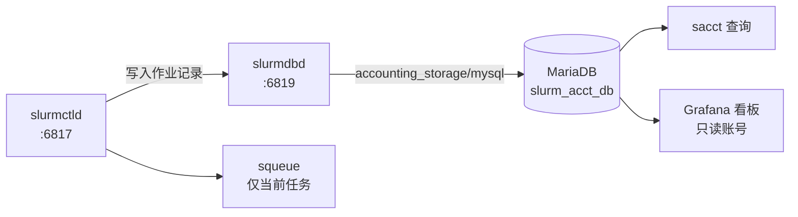

# 记账与用量统计

记账（accounting）解决一个核心问题：**谁在什么时候用了多少 GPU。**
没有它，`squeue` 只能看到「此刻」，任务一结束记录就消失，
既无法回答用户「我上周跑了多久」，也无法做容量规划。

## 架构



| 组件 | 角色 |
|---|---|
| `slurmctld` | 把作业的分配与结束事件发给 `slurmdbd` |
| `slurmdbd` | 记账守护进程，负责认证、聚合与写库 |
| MariaDB | 持久化存储，库名 `slurm_acct_db` |
| `sacct` | 命令行查询历史作业 |
| Grafana | 可视化只读查询 |

!!! info "记账与调度是解耦的"
    `slurmdbd` 挂掉**不会**阻止任务提交和运行，只是这段时间的记录会丢。
    控制器会缓存一部分并重试，但长时间不可用会造成记录缺失。

## 安装 SlurmDBD

!!! danger "不要用 `apt install slurmdbd`"
    Ubuntu 22.04 源里的 Slurm 是 **21.08**，与集群运行的 **25.11.8** 不匹配。
    版本不一致会导致协议不兼容，`slurmdbd` 拒绝连接。
    必须从**同一个源码版本**构建。

### 从源码重新构建（与控制器同版本）

前提：源码构建环境已经准备好（见[部署 Slurm 集群](slurm-deploy.md)）。

```bash
mkdir -p /root/slurm-build
cd /root/slurm-build

curl -fL --retry 3 \
  -o slurm-25.11.8.tar.bz2 \
  https://download.schedmd.com/slurm/slurm-25.11.8.tar.bz2

tar -xjf slurm-25.11.8.tar.bz2
cd slurm-25.11.8

# 确认构建依赖齐全
dpkg-checkbuilddeps && echo "BUILD DEPS OK"

# 构建二进制包
(
  set -o pipefail
  debuild -b -uc -us -j16 2>&1 | tee /root/slurm-build/build-25.11.8.log
) && echo "BUILD OK"
```

!!! tip "重新构建不需要停掉现有服务"
    只要不执行 `apt-get install`，构建过程对运行中的 Slurm 没有影响。
    构建完成后单独安装 `slurmdbd` 包即可。

### 安装

```bash
apt-get install /root/slurm-build/slurm-smd-slurmdbd_25.11.8-1_amd64.deb

# 确认版本一致
slurmdbd -V          # 期望输出：slurm 25.11.8
```

## 配置数据库与 slurmdbd

### MariaDB

```bash
apt-get install mariadb-server
systemctl enable --now mariadb
systemctl is-active mariadb
```

### 一次性写入数据库账号与 `slurmdbd.conf`

!!! tip "用脚本生成密码，不要手写"
    下面的整段脚本会自动生成随机密码并写进权限 `600` 的配置文件，
    不需要你手工填写密码，**也不要把配置文件内容贴到聊天工具或工单里**。

```bash
(
set -e
umask 077

slurm_db_password=$(openssl rand -hex 24)

mariadb <<SQL
CREATE DATABASE IF NOT EXISTS slurm_acct_db;
CREATE USER 'slurm_acct'@'localhost' IDENTIFIED BY '${slurm_db_password}';
GRANT ALL PRIVILEGES ON slurm_acct_db.* TO 'slurm_acct'@'localhost';
SQL

cat > /etc/slurm/slurmdbd.conf <<EOF
AuthType=auth/munge
AuthInfo=/run/munge/munge.socket.2
DbdHost=TenseiNode1
DbdAddr=127.0.0.1
DbdPort=6819
SlurmUser=slurm

StorageType=accounting_storage/mysql
StorageHost=localhost
StoragePort=3306
StorageUser=slurm_acct
StoragePass=${slurm_db_password}
StorageLoc=slurm_acct_db

LogFile=/var/log/slurm/slurmdbd.log
DebugLevel=info
EOF

chown slurm:slurm /etc/slurm/slurmdbd.conf
chmod 600 /etc/slurm/slurmdbd.conf
echo "DATABASE CONFIG OK"
)
```

!!! danger "`slurmdbd.conf` 含数据库明文密码"
    必须保持 `chown slurm:slurm` + `chmod 600`。
    不要把它复制到备份的公开位置，也不要提交进 Git。

### 修正 PID 文件路径

`slurmdbd` 默认尝试写 `/var/run/slurmdbd.pid`，但以 `slurm` 用户运行时权限不足，会报：

```text
error: Unable to open pidfile `/var/run/slurmdbd.pid': Permission denied
```

用 systemd drop-in 指定运行目录：

```bash
mkdir -p /etc/systemd/system/slurmdbd.service.d

cat > /etc/systemd/system/slurmdbd.service.d/runtime.conf <<'EOF'
[Service]
User=slurm
Group=slurm
RuntimeDirectory=slurmdbd
RuntimeDirectoryMode=0755
PIDFile=/run/slurmdbd/slurmdbd.pid
EOF

# 同步写入配置文件的 PidFile
sed -i '/^[[:space:]]*PidFile[[:space:]]*=/d' /etc/slurm/slurmdbd.conf
echo 'PidFile=/run/slurmdbd/slurmdbd.pid' >> /etc/slurm/slurmdbd.conf

systemctl daemon-reload
```

### 启动与验证

```bash
systemctl enable --now munge mariadb
systemctl enable slurmdbd
systemctl restart slurmdbd

systemctl status slurmdbd --no-pager -l
journalctl -u slurmdbd -n 40 --no-pager
tail -n 40 /var/log/slurm/slurmdbd.log
```

### MariaDB 参数调优

`slurmdbd` 启动时会检查数据库参数，`innodb_buffer_pool_size` 与
`innodb_lock_wait_timeout` 使用默认值时会告警：

```text
error: Database settings not recommended values: innodb_buffer_pool_size innodb_lock_wait_timeout
```

```bash
cat > /etc/mysql/mariadb.conf.d/60-slurm.cnf <<'EOF'
[mysqld]
innodb_buffer_pool_size=4G
innodb_lock_wait_timeout=900
max_allowed_packet=64M

[mariadbd]
innodb_snapshot_isolation=OFF
EOF

systemctl stop slurmdbd
systemctl restart mariadb
systemctl start slurmdbd
```

| 参数 | 为什么这么设 |
|---|---|
| `innodb_buffer_pool_size=4G` | 让作业表的索引常驻内存，避免大量查询打磁盘 |
| `innodb_lock_wait_timeout=900` | 记账写入偶发锁等待时不要过早超时 |
| `max_allowed_packet=64M` | 大批量作业记录写入时避免包过大被拒 |
| `innodb_snapshot_isolation=OFF` | Slurm 官方建议，避免快照隔离带来的额外开销 |

## 让控制器接入记账

在 `/etc/slurm/slurm.conf` 末尾追加（先备份并清理旧行）：

```bash
cp -a /etc/slurm/slurm.conf "/root/slurm.conf.bak-$(date +%Y%m%d-%H%M%S)"

sed -i -E '/^[[:space:]]*AccountingStorage(Type|Host|Port|TRES)[[:space:]]*=/d' \
  /etc/slurm/slurm.conf

cat >> /etc/slurm/slurm.conf <<'EOF'

AccountingStorageType=accounting_storage/slurmdbd
AccountingStorageHost=127.0.0.1
AccountingStoragePort=6819
AccountingStorageTRES=gres/gpu
EOF
```

| 配置项 | 含义 |
|---|---|
| `AccountingStorageType=accounting_storage/slurmdbd` | 通过 `slurmdbd` 转发（而不是直连 MySQL） |
| `AccountingStorageHost` / `Port` | `slurmdbd` 监听地址与端口 |
| `AccountingStorageTRES=gres/gpu` | **额外记录 GPU 的分配数量与时长** |

!!! warning "`AccountingStorageTRES` 只记录分配量"
    它记录的是「分配了几张卡、用了多久」，**不是实时利用率**。
    GPU 利用率、显存曲线要靠 DCGM 采集，见[监控与可视化](monitoring.md)。

## 注册集群、账户与用户

记账库需要知道「有哪些集群、哪些账户、哪些用户」。这三层是**记账归属**，
和 Linux 账号是两回事。

```bash
# 1. 注册集群
sacctmgr -i add cluster tensei

# 2. 创建账户（对应「项目 / 课题组」）
sacctmgr -i add account research Cluster=tensei \
  Description="Research users" Organization=tensei

# 3. 把用户关联到账户
sacctmgr -i add user chao    Account=research Cluster=tensei
sacctmgr -i add user wzixuan Account=research Cluster=tensei

# 4. 查看关联关系
sacctmgr show associations format=Cluster,Account,User,DefaultQOS
sacctmgr show cluster format=Cluster,ControlHost,ControlPort
```

!!! note "这一步不增加任何 GPU 限额"
    `add user` 只是建立归属关系，让用量能统计到这个人和这个账户上。
    限额要另配 QOS，见[调度策略与配额](policy.md#如何按需补上这些策略)。

### 重载并确认

```bash
systemctl restart slurmctld
systemctl is-active mariadb slurmdbd slurmctld slurmd
sinfo
```

### 故障处理：`CLUSTER ID MISMATCH`

重启后如果 `sinfo` 报 `Unable to contact slurm controller (connect failure)`，
而 `slurmctld` 处于 `failed`，日志里出现：

```text
fatal: CLUSTER ID MISMATCH.
slurmctld has been started with "ClusterID=868" from the state files in StateSaveLocation,
but the DBD thinks it should be "1415".
Remove /var/spool/slurmctld/clustername to override this safety check if this is intentional.
```

**原因**：控制器状态文件里 `tensei` 的本地集群 ID 是 `868`，
而新建的记账数据库第一次见到这个集群，分配了新的 ID `1415`。
两边对不上，Slurm 出于保护拒绝启动（防止多个集群共用状态目录造成数据损坏）。

**修复**：备份全部状态，**只移走 `clustername` 文件**，
保留 `job_state` / `node_state`，这样正在运行的任务信息不会丢：

```bash
(
set -e

systemctl stop slurmctld

slurm_backup_dir="/root/slurm-state-backup-$(date +%Y%m%d-%H%M%S)"
mkdir -m 700 "$slurm_backup_dir"
cp -a /var/spool/slurmctld "$slurm_backup_dir/"

mv /var/spool/slurmctld/clustername \
   "$slurm_backup_dir/clustername.original"

systemctl start slurmctld
)
```

```bash
systemctl status slurmctld --no-pager -l
sinfo
sacctmgr show cluster format=Cluster,ControlHost,ControlPort
```

!!! danger "不要直接 `rm` 状态目录"
    只移走 `clustername` 一个文件。删除整个 `/var/spool/slurmctld`
    会丢失所有排队作业和节点状态。

!!! note "`MailProg is invalid` 是另一个问题"
    日志里常有 `error: Configured MailProg is invalid`。
    它**不影响启动**，只是邮件通知没配。见[遗留问题](#邮件通知未配置)。

## 验证记账是否工作

用一个普通用户提交真实任务，再查库：

```bash
runuser -l chao -c \
  'srun --immediate=10 -A research -J accounting-test -N1 -n1 \
        --gres=gpu:1 --cpus-per-task=1 --mem=1G --time=00:01:00 nvidia-smi -L'

sacct -S today -u chao -X \
  --format=JobID,User,Account,JobName,State,Elapsed,AllocTRES%70
```

预期能看到任务名 `accounting-test`、状态 `COMPLETED`、
以及 `AllocTRES` 中的 **`gres/gpu=1`**。

## 日常查询

!!! tip "日常用 `sacct`，不需要直接查 MariaDB"

```bash
# 今天所有人的作业（-X 只显示主记录，避免 .batch/.extern 重复）
sacct -a -S today -X \
  --format=JobID,User,Account,JobName%20,State,Start,Elapsed,AllocTRES%70

# 某个人某段时间
sacct -u chao -S 2026-09-11 -E 2026-09-12 -X \
  --format=JobID,JobName%20,State,Elapsed,AllocTRES%70

# 单个作业的详情（含退出码与内存峰值）
sacct -j 3 --format=JobID,JobName,State,ExitCode,Elapsed,MaxRSS

# 实时滚动观察
watch -n 5 'sacct -a -S today -X --format=JobID,User,JobName,State,Elapsed,AllocTRES%60'
```

| 字段 | 含义 |
|---|---|
| `State` | `COMPLETED` / `FAILED` / `CANCELLED` / `TIMEOUT` |
| `Elapsed` | 实际占用时长 |
| `AllocTRES` | 分配的资源，`gres/gpu=2` 表示两张卡 |
| `MaxRSS` | 任务峰值内存 |

!!! warning "`AllocTRES` 是分配量，不是使用量"
    「2 张卡跑 1 小时」= 2 GPU·小时。**这不代表这一小时里卡是满载的。**
    报告用量或做容量规划时不要把它当成算力消耗。

### 数据库结构（排查时用）

```bash
mariadb slurm_acct_db <<'SQL'
SHOW COLUMNS FROM tensei_job_table;
SHOW COLUMNS FROM tensei_assoc_table;
SELECT id, type, name FROM tres_table;
SELECT COUNT(*) AS recorded_jobs FROM tensei_job_table;
SQL
```

表名规则是 `<集群名>_job_table`，所以这里是 `tensei_job_table`。
`tres_table` 里有一个关键映射：

```text
1001	gres	gpu
```

即 **`gres/gpu` 的 TRES id 是 `1001`**。
直接写 SQL 统计 GPU 用量时要靠这个常量从 `tres_alloc` 字段里解析，
详见[监控与可视化](monitoring.md#从-slurm-数据库统计-gpu-卡时)。

## 给 Grafana 开只读账号

!!! danger "绝不要让 Grafana 用 `slurm_acct` 账号"
    `slurm_acct` 对库有全部权限。可视化工具只需要读，
    用一个独立的 `SELECT` 账号能显著降低误操作和凭据泄露的风险。

```bash
(
set -e
umask 077

grafana_db_password=$(openssl rand -hex 24)

mariadb <<SQL
CREATE USER 'grafana_slurm'@'localhost' IDENTIFIED BY '${grafana_db_password}';
CREATE USER 'grafana_slurm'@'127.0.0.1' IDENTIFIED BY '${grafana_db_password}';
GRANT SELECT ON slurm_acct_db.* TO 'grafana_slurm'@'localhost';
GRANT SELECT ON slurm_acct_db.* TO 'grafana_slurm'@'127.0.0.1';
SQL

install -d -m 0755 /etc/grafana/provisioning/datasources

cat > /etc/grafana/provisioning/datasources/slurm.yaml <<EOF
apiVersion: 1
datasources:
  - name: Slurm Accounting
    uid: slurm-accounting
    type: mysql
    access: proxy
    url: 127.0.0.1:3306
    user: grafana_slurm
    isDefault: true
    editable: false
    jsonData:
      database: slurm_acct_db
      maxOpenConns: 5
      maxIdleConns: 2
      connMaxLifetime: 14400
      timezone: "+00:00"
    secureJsonData:
      password: "${grafana_db_password}"
EOF

chown root:grafana /etc/grafana/provisioning/datasources/slurm.yaml
chmod 640 /etc/grafana/provisioning/datasources/slurm.yaml

systemctl restart grafana-server
echo "DATASOURCE CONFIG OK"
)
```

!!! warning "这段输出不要外传"
    `slurm.yaml` 里有数据库密码。校验时只看命令是否报错，
    **不要把文件内容贴出来**。用 `configtest` 式的方式确认即可：

    ```bash
    systemctl is-active grafana-server
    journalctl -u grafana-server -n 30 --no-pager | grep -i datasource
    ```

## 备份与保留

记账数据是**不可再生**的：任务记录一旦丢失就无法恢复。
它必须纳入备份范围。

```bash
# 逻辑备份（推荐，可跨版本恢复）
mariadb-dump --single-transaction slurm_acct_db \
  | gzip > "/root/backup/slurm_acct_db-$(date +%F).sql.gz"
```

| 要备份的内容 | 位置 | 说明 |
|---|---|---|
| 记账数据库 | `slurm_acct_db` | 用 `mariadb-dump` |
| Slurm 配置 | `/etc/slurm/` | `slurm.conf`、`slurmdbd.conf`、`gres.conf`、`cgroup.conf` |
| 控制器状态 | `/var/spool/slurmctld/` | 含排队作业与节点状态 |
| 二进制包 | `/root/slurm-packages/25.11.8/` | 扩容新节点时直接复用 |

!!! note "MariaDB 的 `mysql` 系统库同样重要"
    只备份 `slurm_acct_db` 的话，恢复后会发现**数据库账号没了**。
    要么把 `mysql` 库一起备份，要么在恢复后重建 `slurm_acct` 与 `grafana_slurm` 账号。

详见[备份、扩容与日常运维](ops.md)。

## 遗留问题

### 邮件通知未配置

`slurmctld` 每次启动都会记录：

```text
error: Configured MailProg is invalid
```

这说明 `MailProg` 指向的程序不存在。Slurm 默认使用 `/usr/bin/mail`，
需要系统有一个可用的 MTA。

!!! warning "这是一个独立的待办项"
    它**不影响调度和记账**，但用户无法通过 `--mail-type` 收到任务通知。
    修复方式二选一：

    ```bash
    # 方案 A：装一个轻量 MTA
    apt-get install -y msmtp-mta
    # 配置 /etc/msmtprc 指向你的 SMTP 服务器

    # 方案 B：在 slurm.conf 里指向可用程序
    # MailProg=/usr/bin/msmtp
    ```

    配置完成后 `systemctl restart slurmctld`，
    再用 `sbatch --mail-type=END --mail-user=you@example.com` 验证。

### 尚未启用的记账限制

| 项目 | 现状 |
|---|---|
| `AccountingStorageEnforce=associations` | 未启用，**未注册用户仍可提交任务** |
| QOS 分级 | 未创建任何 QoS，全部使用内置 `normal` |
| Fair-share | 未启用，优先级不随历史用量衰减 |

启用方法见[调度策略与配额](policy.md#如何按需补上这些策略)。

## 相关文档

* [调度策略与配额](policy.md) —— `DefMemPerCPU`、时限、QOS 限额
* [监控与可视化](monitoring.md) —— 把记账数据做成交互式看板
* [备份、扩容与日常运维](ops.md) —— 数据库备份与恢复演练
