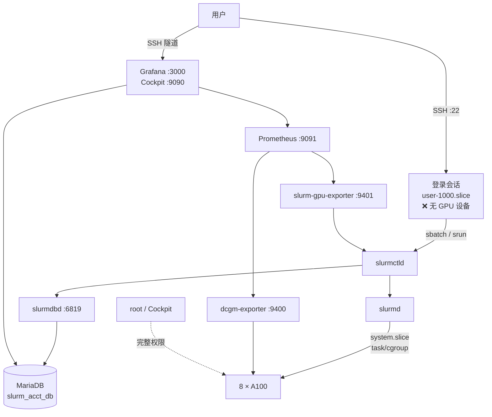

# 管理员手册

本部分面向集群管理员，覆盖从零部署到日常运维的完整流程。
所有命令与配置都来自一次真实的部署过程，包括踩过的坑。

!!! danger "管理员的第一原则"
    **改动前先备份，改动后必验证，验证要用普通用户身份。**

    root 身份下几乎所有操作都会「看起来成功」，
    但用户侧的权限、cgroup、记账归属只有用普通账号实测才能发现问题。

## 当前集群状态

| 组件 | 状态 | 版本 |
|---|---|---|
| 操作系统 | ✅ | Ubuntu 22.04.4 LTS |
| NVIDIA 驱动 | ✅ | `550.144.03` / CUDA `12.4` |
| Fabric Manager | ✅ | 正常配置 8 张卡与 NVSwitch 的 NVLink 路由 |
| Slurm | ✅ | `25.11.8`（源码构建） |
| cgroup v2 隔离 | ✅ | `ConstrainCores` / `RAMSpace` / `Devices` |
| 记账（SlurmDBD + MariaDB） | ✅ | 账户 `research` 已建立 |
| GPU 监控 | ✅ | Prometheus + DCGM Exporter + Grafana |
| 用户会话设备限制 | ✅ | `DevicePolicy=closed` |
| 开户 / 销户流程 | ✅ | `tensei-add-user` |
| 主机指标监控 | ❌ | `node-exporter` 未安装 |
| 告警 | ❌ | 无 Alertmanager，无告警规则 |
| 每用户配额 / 公平份额 | ❌ | 未配置 |
| 备份与恢复演练 | ❌ | 未建立 |
| 邮件通知 | ❌ | `MailProg` 无效 |
| Open OnDemand | ⏸️ | 已安装，暂停使用 |

## 架构总览

## 阅读顺序

### 从零搭建一台新机器

| 顺序 | 文档 | 内容 |
|---|---|---|
| 1 | [部署 Slurm 集群](slurm-deploy.md) | 前置检查、源码编译、配置、启动、验证 |
| 2 | [调度策略与配额](policy.md) | 队列、时限、内存、GPU 分配模型 |
| 3 | [记账与用量统计](accounting.md) | SlurmDBD + MariaDB |
| 4 | [访问入口与安全加固](access-security.md) | 阻止绕过 Slurm、Cockpit、端口策略 |
| 5 | [用户与账号管理](users.md) | 开户、销户、批量管理 |
| 6 | [监控与可视化](monitoring.md) | Prometheus + DCGM + Grafana |
| 7 | [备份、扩容与日常运维](ops.md) | 备份、扩容、例行检查 |

### 日常运维常用

| 我要…… | 命令 / 文档 |
|---|---|
| 看集群是否正常 | `sinfo` + `systemctl is-active slurmctld slurmd slurmdbd mariadb` |
| 看谁在排队、为什么 | `squeue -o "%.8i %.12u %.18j %.10T %.10M %.10l %.20b %R"` |
| 看服务日志 | `journalctl -u slurmctld -u slurmd --since today -f` |
| 看 GPU 实时占用 | Grafana 看板（SSH 隧道） |
| 看历史用量 | `sacct -a -S today -X --format=JobID,User,Account,State,Elapsed,AllocTRES%70` |
| 开一个新账号 | `tensei-add-user <用户名>` |
| 删一个账号 | [销户流程](users.md#销户彻底删除一个用户) |
| 恢复被 drain 的节点 | `scontrol update NodeName=<节点> State=RESUME` |
| 改调度策略 | [标准流程](policy.md#修改策略的标准流程) |
| 怀疑有人绕过 Slurm | [安全复查脚本](access-security.md#加固检查清单) |
| 加一台新机器 | [扩容清单](ops.md#扩展到多节点) |

## 关键约定

!!! note "环境相关的占位符"
    文档中的以下值需要替换为你自己的环境：

    | 占位符 | 当前值 | 出现位置 |
    |---|---|---|
    | 集群名 | `tensei` | `slurm.conf`、数据库表名前缀 |
    | 节点名 | `TenseiNode1` | `slurm.conf`、`gres.conf`、监控查询 |
    | 队列名 | `gpu` | 用户提交命令 |
    | Slurm 账户 | `research` | `sacctmgr` |
    | 数据库名 | `slurm_acct_db` | `slurmdbd.conf`、Grafana |
    | GPU 类型标签 | `a100` | `gres.conf` |

!!! warning "Slurm 版本一旦确定就不要随意升级"
    控制器、计算节点、记账服务必须是**同一个版本**。
    升级要同时更新所有节点，并且 `slurmdbd` 要先于 `slurmctld` 升级。

## 危险操作清单

这些操作影响面大，执行前务必确认已经备份、并且知道如何回滚。

| 操作 | 风险 | 前置条件 |
|---|---|---|
| 改 `ClusterName` | 触发 `CLUSTER ID MISMATCH`，控制器无法启动 | 备份 `/var/spool/slurmctld` |
| 删除 `/var/spool/slurmctld` | 丢失全部排队作业与节点状态 | — |
| 改 `ConstrainDevices` | 关掉后 GPU 隔离失效 | 通知用户 |
| 升级 NVIDIA 驱动 | 忘记同步升级 Fabric Manager 会让 8 张卡全部不可用 | 先在单台验证 |
| `apt autoremove` | 可能删掉 Slurm 构建依赖、甚至 NVIDIA 包 | 先看它打算删什么 |
| 启用 `AccountingStorageEnforce=associations` | 未注册用户立刻无法提交任务 | 先核对 `sacctmgr` 记录 |
| `userdel -r` | **永久删除家目录** | 确认已备份 |
| 重启 `slurmctld` | 正在运行的任务不受影响，但排队顺序会重新计算 | 避开高峰 |

!!! danger "升级 NVIDIA 驱动必须同时处理 Fabric Manager"
    驱动与 Fabric Manager 的版本必须**完全一致**（例如都是 `550.54.15`）。
    只升级驱动会破坏 NVSwitch 的 NVLink 路由配置，
    表现为多卡训练异常或部分卡不可见。

    升级前先在**一台**机器上验证，通过后再推广到其他节点。

## 待办与改进方向

按优先级排列：

| 优先级 | 事项 | 原因 |
|---|---|---|
| **高** | 建立备份与恢复流程 | 记账数据不可再生；配置丢失要重装整个集群 |
| **高** | 安装 `node-exporter` + 磁盘告警 | 磁盘写满会让 MariaDB 与 `slurmctld` 无法写入 |
| **中** | 配置每用户 GPU 上限 / QOS | 目前一个人可以占满 8 张卡 |
| **中** | 修复邮件通知（`MailProg`） | 用户无法收到任务结束通知 |
| **中** | 启用公平份额 | 让优先级随历史用量衰减 |
| **低** | 把 Grafana 看板改为 provisioning 管理 | 目前看板只存在 Grafana 数据库里，重装会丢 |
| **低** | 引入 Ansible | 多节点后批量管理 |
| **低** | 评估 Open OnDemand 重新启用 | 需要网页提交任务时 |

详见[备份、扩容与日常运维](ops.md#待办清单)。

## 相关文档

* [用户指南](../user/quickstart.md) —— 用户看到的版本，改策略时要同步更新
