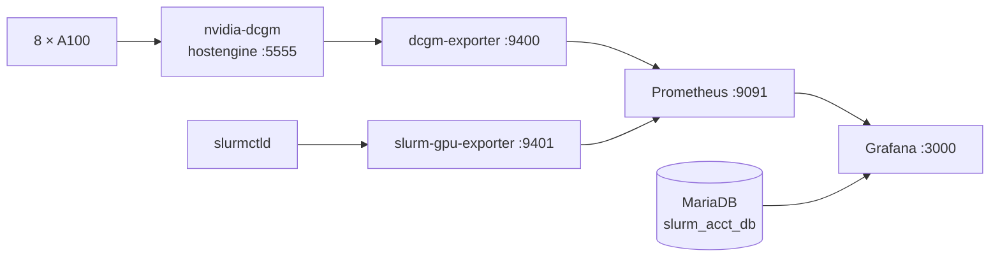

# 监控与可视化

监控要回答三个层次的问题：

1. **机器还活着吗** —— 服务状态、显存、温度、功耗；
2. **卡在忙什么** —— 每张卡的利用率、显存占用曲线；
3. **卡被谁占着** —— 哪张卡分配给了哪个用户、哪个任务。

第 1、2 层由 **DCGM Exporter + Prometheus + Grafana** 解决；
第 3 层是 Slurm 的记账信息，需要额外的导出器才能和 GPU 指标对上，
这是整套监控里最容易被低估的部分。

## 组件与端口

| 组件 | 版本 | 监听地址 | 安装方式 | 服务名 |
|---|---|---|---|---|
| Prometheus | `2.31.2`（Ubuntu jammy universe） | `127.0.0.1:9091` | apt + systemd drop-in | `prometheus` |
| DCGM | `3.1.7` | 本机 hostengine `:5555` | NVIDIA apt 包（预装） | `nvidia-dcgm` |
| DCGM Exporter | 源码 tag `3.1.7-3.1.4` | `127.0.0.1:9400` | **源码编译** | `dcgm-exporter` |
| Grafana | `13.2.1` | `127.0.0.1:3000` | 手动 `.deb` | `grafana-server` |
| slurm-gpu-exporter | 自研 Python | `127.0.0.1:9401` | 手写脚本 + systemd | `slurm-gpu-exporter` |
| MariaDB | — | `127.0.0.1:3306` | apt | `mariadb` |
| Cockpit | — | `127.0.0.1:9090` | 预装 | `cockpit.socket` |
| node-exporter | **未安装** | — | — | — |

!!! warning "Prometheus 用的是 9091"
    Cockpit 已经占用了 `127.0.0.1:9090`。Debian/Ubuntu 的 Prometheus 包默认也监听 9090，
    直接安装会启动失败。我们用 systemd drop-in 把它改到 **9091**。

!!! info "所有服务只监听 `127.0.0.1`"
    这是有意的：监控数据不经过公网，访问统一走 SSH 隧道。
    见[通过 SSH 隧道访问面板](access-security.md#通过-ssh-隧道访问面板)。

数据链路：



## 安装 Prometheus

### 先在 drop-in 里改端口，再安装

!!! danger "顺序不能反"
    如果先 `apt install` 再改端口，Prometheus 会因为 9090 被占用而启动失败。
    先把 drop-in 写好，再安装。

```bash
(
set -e

# 安装前设置启动参数，避免与 Cockpit 的 9090 冲突
install -d /etc/systemd/system/prometheus.service.d

cat > /etc/systemd/system/prometheus.service.d/local.conf <<'EOF'
[Service]
ExecStart=
ExecStart=/usr/bin/prometheus --config.file=/etc/prometheus/prometheus.yml --storage.tsdb.path=/var/lib/prometheus/metrics2 --web.listen-address=127.0.0.1:9091 --storage.tsdb.retention.time=30d
EOF

systemctl daemon-reload

apt-get install --no-install-recommends -y prometheus

# 备份默认配置
cp -a /etc/prometheus/prometheus.yml \
  "/etc/prometheus/prometheus.yml.bak-$(date +%Y%m%d-%H%M%S)"

cat > /etc/prometheus/prometheus.yml <<'EOF'
global:
  scrape_interval: 15s
  evaluation_interval: 15s

scrape_configs:
  - job_name: prometheus
    static_configs:
      - targets: ['127.0.0.1:9091']
EOF

install -d -o prometheus -g prometheus /var/lib/prometheus/metrics2

promtool check config /etc/prometheus/prometheus.yml

systemctl enable prometheus
systemctl restart prometheus
)
```

!!! note "drop-in 里为什么有一行空的 `ExecStart=`"
    systemd 的服务指令是**追加**语义。只写新的 `ExecStart=` 会导致有两个启动命令。
    先写一行空的 `ExecStart=` 清空原有值，再写新值。

| 启动参数 | 作用 |
|---|---|
| `--web.listen-address=127.0.0.1:9091` | 只监听本机，避开 Cockpit |
| `--storage.tsdb.retention.time=30d` | 历史指标保留 30 天 |
| `--storage.tsdb.path=/var/lib/prometheus/metrics2` | 换一个数据目录，避免与包默认目录权限冲突 |

### 最终的 `prometheus.yml`

```yaml
global:
  scrape_interval: 15s
  evaluation_interval: 15s

scrape_configs:
  - job_name: prometheus
    static_configs:
      - targets: ['127.0.0.1:9091']

  - job_name: dcgm
    static_configs:
      - targets: ['127.0.0.1:9400']
        labels:
          cluster: tensei
          node: TenseiNode1

  - job_name: slurm-gpu
    static_configs:
      - targets: ['127.0.0.1:9401']
        labels:
          cluster: tensei
```

!!! tip "加 `node` 标签是为了将来扩容"
    现在只有一个节点，标签看起来多余。但扩到 5 台后，
    所有查询都靠 `node="TenseiNode1"` 区分数据来源，提前加上省事。

### 校验与重启

```bash
promtool check config /etc/prometheus/prometheus.yml
systemctl restart prometheus

systemctl is-active prometheus
curl --noproxy '*' -fsS http://127.0.0.1:9091/-/ready
# 期望输出：Prometheus is Ready.
```

!!! tip "为什么都要带 `--noproxy '*'`"
    服务器上配置了 HTTP 代理时，`curl 127.0.0.1` 也会被送到代理，
    导致本机请求失败。`--noproxy '*'` 强制直连。

## 启用 DCGM

DCGM（Data Center GPU Manager）是 NVIDIA 的 GPU 管理中间件，
DCGM Exporter 通过它读取指标。

先确认 DCGM 已安装：

```bash
command -v dcgmi nv-hostengine
apt-cache policy datacenter-gpu-manager
```

### 常见故障：hostengine 没有启动

如果直接跑 `dcgmi`，会看到：

```text
Error: unable to establish a connection to the specified host: localhost
Error: Unable to connect to host engine. Host engine connection invalid/disconnected.
```

**原因是 `nvidia-dcgm.service` 处于 `inactive (dead)` 且 `disabled`** ——
hostengine 进程根本没在跑。

```bash
systemctl enable --now nvidia-dcgm
systemctl status nvidia-dcgm --no-pager -l
dcgmi discovery -l
```

`nvidia-dcgm` 启动的命令是：

```text
/usr/bin/nv-hostengine -n --service-account nvidia-dcgm
```

`dcgmi discovery -l` 正常时应列出 **8 张 A100**。

!!! warning "DCGM 服务名容易搞混"
    包名是 `datacenter-gpu-manager`，但服务名是 `nvidia-dcgm`，
    可执行文件是 `nv-hostengine` 与 `dcgmi`。

## 编译安装 DCGM Exporter

!!! note "没有 apt 包，必须从源码编译"
    Ubuntu 源里不存在 exporter 包：

    ```text
    N: Unable to locate package datacenter-gpu-manager-exporter
    ```

    DCGM Exporter 必须与 DCGM 版本配套。当前 DCGM 是 `3.1.7`，
    对应的 exporter 发布标签是 **`3.1.7-3.1.4`**。

```bash
(
set -e

apt-get install --no-install-recommends -y \
  golang-go build-essential git ca-certificates

install -d /root/monitoring-build
cd /root/monitoring-build

git clone --depth 1 --branch 3.1.7-3.1.4 \
  https://github.com/NVIDIA/dcgm-exporter.git \
  dcgm-exporter-3.1.7-3.1.4

cd dcgm-exporter-3.1.7-3.1.4

# 使用 Go 模块镜像下载编译依赖，保留校验
export GOPROXY=https://goproxy.cn,https://proxy.golang.org,direct

make binary

install -m 0755 cmd/dcgm-exporter/dcgm-exporter \
  /usr/local/bin/dcgm-exporter

/usr/local/bin/dcgm-exporter --version

echo "EXPORTER BUILD OK"
)
```

!!! tip "国内网络：`GOPROXY` 要用 `goproxy.cn`"
    直连 `proxy.golang.org` 通常超时。写 `https://goproxy.cn,https://proxy.golang.org,direct`
    会优先走国内镜像，失败再依次回退。

### 指标白名单

默认会暴露上千个指标，绝大部分用不上，还会撑大 Prometheus 存储。
用 `counters.csv` 只保留必要的：

```csv
DCGM_FI_DEV_GPU_UTIL, gauge, GPU utilization (%).
DCGM_FI_DEV_FB_USED, gauge, Framebuffer memory used (MiB).
DCGM_FI_DEV_FB_FREE, gauge, Framebuffer memory free (MiB).
DCGM_FI_DEV_GPU_TEMP, gauge, GPU temperature (C).
DCGM_FI_DEV_POWER_USAGE, gauge, Power usage (W).
DCGM_FI_DEV_SM_CLOCK, gauge, SM clock (MHz).
DCGM_FI_DEV_MEM_CLOCK, gauge, Memory clock (MHz).
DCGM_FI_DEV_XID_ERRORS, gauge, Last XID error.
```

| 指标 | 用途 |
|---|---|
| `DCGM_FI_DEV_GPU_UTIL` | 利用率，判断卡是否真的在算 |
| `DCGM_FI_DEV_FB_USED` / `FB_FREE` | 显存占用，排查 OOM |
| `DCGM_FI_DEV_GPU_TEMP` | 温度，散热异常的第一信号 |
| `DCGM_FI_DEV_POWER_USAGE` | 功耗，估算能耗与判断是否空闲 |
| `DCGM_FI_DEV_XID_ERRORS` | XID 错误码，硬件故障排查的关键 |

### systemd 服务

```bash
(
set -e

install -d -m 0755 /etc/dcgm-exporter

cat > /etc/dcgm-exporter/counters.csv <<'EOF'
DCGM_FI_DEV_GPU_UTIL, gauge, GPU utilization (%).
DCGM_FI_DEV_FB_USED, gauge, Framebuffer memory used (MiB).
DCGM_FI_DEV_FB_FREE, gauge, Framebuffer memory free (MiB).
DCGM_FI_DEV_GPU_TEMP, gauge, GPU temperature (C).
DCGM_FI_DEV_POWER_USAGE, gauge, Power usage (W).
DCGM_FI_DEV_SM_CLOCK, gauge, SM clock (MHz).
DCGM_FI_DEV_MEM_CLOCK, gauge, Memory clock (MHz).
DCGM_FI_DEV_XID_ERRORS, gauge, Last XID error.
EOF

cat > /etc/systemd/system/dcgm-exporter.service <<'EOF'
[Unit]
Description=NVIDIA GPU metrics exporter
Wants=nvidia-dcgm.service
After=network.target nvidia-dcgm.service

[Service]
Type=simple
User=nvidia-dcgm
ExecStart=/usr/local/bin/dcgm-exporter -r 127.0.0.1:5555 -a 127.0.0.1:9400 -c 15000 -f /etc/dcgm-exporter/counters.csv
Restart=on-failure
RestartSec=5

[Install]
WantedBy=multi-user.target
EOF

chmod 644 /etc/dcgm-exporter/counters.csv
systemctl daemon-reload
systemctl enable --now dcgm-exporter
)
```

| flag | 值 | 含义 |
|---|---|---|
| `-r` | `127.0.0.1:5555` | 连接本机 DCGM hostengine |
| `-a` | `127.0.0.1:9400` | exporter 监听地址 |
| `-c` | `15000` | 采集间隔 15 秒 |
| `-f` | `/etc/dcgm-exporter/counters.csv` | 指标白名单 |

!!! note "`Wants=` 与 `After=` 保证启动顺序"
    `nvidia-dcgm` 必须先起来，exporter 才能连上 hostengine。
    两个指令都要写：`After` 管顺序，`Wants` 管依赖拉起。

### 验证

```bash
systemctl is-active dcgm-exporter prometheus
journalctl -u dcgm-exporter -n 50 --no-pager

# 直接看 exporter 输出
curl --noproxy '*' -fsS http://127.0.0.1:9400/metrics \
  | grep '^DCGM_FI_DEV_GPU_UTIL{'
```

应输出 8 行，每行对应一张卡：

```text
DCGM_FI_DEV_GPU_UTIL{gpu="0",UUID="GPU-a0276972-...",device="nvidia0",modelName="NVIDIA A100-SXM4-80GB",Hostname="TenseiNode1"} 0
...
```

再通过 Prometheus 确认采集到了 8 张卡：

```bash
curl --noproxy '*' -fsSG http://127.0.0.1:9091/api/v1/query \
  --data-urlencode 'query=count(DCGM_FI_DEV_GPU_UTIL{job="dcgm"})'
```

期望返回 `"8"`。**如果返回小于 8，说明有卡没被采集到，先查 `nvidia-dcgm` 状态。**

## 安装 Grafana

!!! note "为什么不用 apt 直接装"
    在这一环境中，`apt-get install grafana` 需要访问 `apt.grafana.com`，
    受网络/代理限制经常失败。可靠的替代方案是：
    **在能上网的机器上下载 `.deb`，上传到服务器，再让 apt 从本地缓存安装。**

### 先拿到准确的下载地址与校验值

```bash
apt-get --print-uris --download-only install grafana
```

输出示例：

```text
'https://apt.grafana.com/pool/main/g/grafana/grafana_13.2.1_33191028959_linux_amd64.deb' grafana_13.2.1_amd64.deb 374714452 MD5Sum:7c02e9c6195971adda2ab40b03ad8bd2
```

三个关键信息：**URL、字节数、MD5**。用它们校验下载是否完整。

### 下载、上传、校验

在能上网的机器上下载该 URL，上传到服务器 `/root/`，
然后**必须校验**：

```bash
stat -c '%s' /root/grafana_13.2.1_amd64.deb
md5sum /root/grafana_13.2.1_amd64.deb
```

!!! danger "文件大小和 MD5 必须与 `--print-uris` 输出一致"
    375 MB 的文件在网络不稳时很容易下载不完整。
    大小或 MD5 不符就直接重新下载 ——
    半个 `.deb` 装到一半失败会让系统处于难以收拾的状态。

### 从本地缓存安装

```bash
cp /root/grafana_13.2.1_amd64.deb /var/cache/apt/archives/
chmod 644 /var/cache/apt/archives/grafana_13.2.1_amd64.deb

apt-get --no-download install grafana=13.2.1
```

`--no-download` 让 apt 只使用本地缓存。

### 只监听本机

```bash
mkdir -p /etc/systemd/system/grafana-server.service.d

cat > /etc/systemd/system/grafana-server.service.d/local.conf <<'EOF'
[Service]
Environment="GF_SERVER_HTTP_ADDR=127.0.0.1"
Environment="GF_SERVER_HTTP_PORT=3000"
Environment="GF_SERVER_ROOT_URL=http://localhost:3000/"
Environment="GF_USERS_ALLOW_SIGN_UP=false"
Environment="GF_AUTH_ANONYMOUS_ENABLED=false"
EOF

systemctl daemon-reload
systemctl enable --now grafana-server
systemctl restart grafana-server
```

| 环境变量 | 作用 |
|---|---|
| `GF_SERVER_HTTP_ADDR=127.0.0.1` | **只监听本机** |
| `GF_SERVER_ROOT_URL` | 生成链接用的地址，与隧道访问地址一致 |
| `GF_USERS_ALLOW_SIGN_UP=false` | 禁止自助注册，账号必须管理员创建 |
| `GF_AUTH_ANONYMOUS_ENABLED=false` | 禁止匿名访问 |

### 验证

```bash
systemctl status grafana-server --no-pager -l
ss -lntp 'sport = :3000'
curl --noproxy '*' http://127.0.0.1:3000/api/health
```

!!! danger "首次登录后立刻改掉 admin 密码"
    初始账号是 `admin` / `admin`。通过隧道登录后
    在 **Administration → Users** 里修改密码。

## 配置数据源

用 provisioning 文件声明数据源，比在 UI 里点更可复现，也方便纳入备份。

### Slurm 记账（MySQL 只读）

!!! danger "必须用只读账号"
    不要让 Grafana 用 `slurm_acct`（有全部权限）。创建独立的 `SELECT` 账号。

```bash
(
set -e
umask 077

grafana_db_password=$(openssl rand -hex 24)

mariadb <<SQL
CREATE USER 'grafana_slurm'@'localhost' IDENTIFIED BY '${grafana_db_password}';
CREATE USER 'grafana_slurm'@'127.0.0.1' IDENTIFIED BY '${grafana_db_password}';
GRANT SELECT ON slurm_acct_db.* TO 'grafana_slurm'@'localhost';
GRANT SELECT ON slurm_acct_db.* TO 'grafana_slurm'@'127.0.0.1';
SQL

install -d -m 0755 /etc/grafana/provisioning/datasources

cat > /etc/grafana/provisioning/datasources/slurm.yaml <<EOF
apiVersion: 1
datasources:
  - name: Slurm Accounting
    uid: slurm-accounting
    type: mysql
    access: proxy
    url: 127.0.0.1:3306
    user: grafana_slurm
    isDefault: true
    editable: false
    jsonData:
      database: slurm_acct_db
      maxOpenConns: 5
      maxIdleConns: 2
      connMaxLifetime: 14400
      timezone: "+00:00"
    secureJsonData:
      password: "${grafana_db_password}"
EOF

chown root:grafana /etc/grafana/provisioning/datasources/slurm.yaml
chmod 640 /etc/grafana/provisioning/datasources/slurm.yaml

systemctl restart grafana-server
echo "DATASOURCE CONFIG OK"
)
```

!!! warning "这个文件包含密码"
    校验时只看命令有没有报错，或用健康检查接口确认：

    ```bash
    curl --noproxy '*' -fsS \
      http://127.0.0.1:3000/api/datasources/uid/slurm-accounting/health
    ```

### Prometheus

```bash
cat > /etc/grafana/provisioning/datasources/prometheus.yaml <<'EOF'
apiVersion: 1
datasources:
  - name: GPU Monitoring
    uid: gpu-prometheus
    type: prometheus
    access: proxy
    url: http://127.0.0.1:9091
    isDefault: false
    editable: false
    jsonData:
      httpMethod: POST
      timeInterval: 15s
EOF

chown root:grafana /etc/grafana/provisioning/datasources/prometheus.yaml
chmod 640 /etc/grafana/provisioning/datasources/prometheus.yaml

systemctl restart grafana-server
```

!!! warning "URL 是 `9091` 不是 `9090`"
    写错会连到 Cockpit，表现为数据源测试失败或返回非 Prometheus 响应。

## 采集「哪张卡被谁占用」

!!! info "这是整套监控里唯一需要自己写代码的部分"
    DCGM 只知道「GPU 0 利用率 87%」，不知道「GPU 0 属于 chao 的任务 4」。
    Slurm 知道归属，但它的数据在 MariaDB 里。
    两者唯一的公共标识是 **GPU 的 UUID**（DCGM 有，Slurm 的分配信息里也有）。

    解法：写一个小的导出器，把 `scontrol show job -d` 里的 GPU 索引解析成
    带 `user` / `job_id` 标签的 Prometheus 指标。

### 导出器脚本

`/opt/slurm-gpu-exporter/exporter.py` 的要点：

```python
NODE = "TenseiNode1"
ACTIVE = {"RUNNING", "SUSPENDED", "COMPLETING", "CONFIGURING"}
```

1. 用 `nvidia-smi --query-gpu=index,uuid --format=csv,noheader,nounits` 取 `index → UUID` 映射；
2. 用 `scontrol show job -d` 逐块解析 `JobId=`、`JobName`、`JobState`、`UserId=user(uid)`；
3. 从分配行 `Nodes=TenseiNode1 … GRES=gpu:a100:1(IDX:0)` 提取索引：

    ```python
    matches = re.findall(
        r"gpu:(?:[^:\s()]+:)?(\d+)\(IDX:([0-9,-]+)\)",
        line
    )
    ```

4. 输出指标：

    ```text
    # TYPE slurm_gpu_allocation_info gauge
    slurm_gpu_allocation_info{node="TenseiNode1",gpu="0",UUID="GPU-...",user="chao",job_id="4",job_name="gpu-owner-test",state="RUNNING"} 1
    ```

未分配的卡输出 `state="UNALLOCATED"`、`user="-"`。

!!! danger "采集失败时绝不能假装空闲"
    如果 `scontrol` 超时或解析失败，脚本**只输出**：

    ```text
    # TYPE slurm_gpu_exporter_success gauge
    slurm_gpu_exporter_success 0
    ```

    不要输出 8 行 `UNALLOCATED`。
    否则看板会把「采集挂了」显示成「卡都空着」，
    管理员据此判断就会严重误判。

### systemd 服务

```ini
[Unit]
Description=Slurm GPU allocation exporter
After=network.target slurmctld.service

[Service]
Type=simple
User=root
ExecStart=/usr/bin/python3 /opt/slurm-gpu-exporter/exporter.py
Restart=on-failure
RestartSec=5
Environment=PYTHONUNBUFFERED=1

[Install]
WantedBy=multi-user.target
```

```bash
python3 -m py_compile /opt/slurm-gpu-exporter/exporter.py &&
systemctl daemon-reload &&
systemctl enable --now slurm-gpu-exporter
```

!!! warning "需要 `User=root`"
    `scontrol show job -d` 要读全部用户的任务信息，
    普通用户只能看到自己的。这个服务只监听本机，风险可控。

### 验证

```bash
curl --noproxy '*' -fsS http://127.0.0.1:9401/metrics
journalctl -u slurm-gpu-exporter -n 30 --no-pager
```

期望：`slurm_gpu_exporter_success 1` + 8 行 `slurm_gpu_allocation_info`。

## Grafana 看板

三个看板分工明确：

| 看板 | 数据源 | 回答的问题 | 时间范围 |
|---|---|---|---|
| **Tensei GPU 使用统计** | Slurm 记账（SQL） | 谁用了多少卡时、有哪些任务 | `now-24h`，30s 刷新 |
| **Tensei GPU 实时监控** | Prometheus（DCGM） | 每张卡此刻的利用率、显存、温度、功耗 | `now-30m`，15s 刷新 |
| **Tensei GPU 用户与任务** | 两者按 UUID 关联 | 这一张卡现在属于谁、跑什么任务 | `now-30m`，15s 刷新 |

### 导入方式

在 Grafana 中新建 Dashboard，切到 **Code / JSON Model**，
粘贴看板 JSON 后 **Save changes**。

!!! note "看板没有用 provisioning 管理"
    当前三个看板是在 UI 里以 `dashboard.grafana.app/v2` 格式粘贴导入的，
    存在 Grafana 自己的数据库里。**这意味着它们不在 `/etc/grafana` 里，
    常规配置备份不会覆盖它们**，迁移或重装前要单独导出 JSON。

### 从 Slurm 数据库统计 GPU 卡时

核心难点：GPU 数量存在 `tres_alloc` 文本字段里，
格式形如 `cpu=8,mem=32G,gres/gpu=2`。需要按 TRES id 解析：

!!! note "`gres/gpu` 的 TRES id 是 `1001`"
    这个常量来自 `tres_table`：

    ```text
    1001	gres	gpu
    ```

解析出来的标准写法（两个面板共用）：

```sql
CASE
  WHEN CONCAT(',', j.tres_alloc, ',') LIKE '%,1001=%'
  THEN CAST(
    SUBSTRING_INDEX(
      SUBSTRING_INDEX(CONCAT(',', j.tres_alloc), ',1001=', -1),
      ',', 1
    ) AS UNSIGNED
  )
  ELSE 0
END AS `分配GPU数`
```

**任务明细面板**（table）：

```sql
SELECT
  j.id_job AS `任务ID`,
  COALESCE(NULLIF(a.user, ''), CONCAT('UID:', j.id_user)) AS `用户`,
  j.account AS `账户`,
  j.job_name AS `任务名称`,
  j.partition AS `分区`,
  CASE (j.state & 255)
    WHEN 0 THEN '排队'   WHEN 1 THEN '运行中' WHEN 2 THEN '暂停'
    WHEN 3 THEN '完成'   WHEN 4 THEN '取消'   WHEN 5 THEN '失败'
    WHEN 6 THEN '超时'   WHEN 7 THEN '节点故障' WHEN 8 THEN '被抢占'
    WHEN 9 THEN '启动失败' WHEN 10 THEN '超过截止时间' WHEN 11 THEN '内存不足'
    ELSE CONCAT('状态:', j.state)
  END AS `状态`,
  CASE
    WHEN CONCAT(',', j.tres_alloc, ',') LIKE '%,1001=%'
    THEN CAST(SUBSTRING_INDEX(SUBSTRING_INDEX(CONCAT(',', j.tres_alloc), ',1001=', -1), ',', 1) AS UNSIGNED)
    ELSE 0
  END AS `分配GPU数`,
  FROM_UNIXTIME(j.time_submit) AS `提交时间`,
  FROM_UNIXTIME(NULLIF(j.time_start, 0)) AS `开始时间`,
  FROM_UNIXTIME(NULLIF(j.time_end, 0)) AS `结束时间`,
  j.nodelist AS `节点`
FROM tensei_job_table j
LEFT JOIN tensei_assoc_table a ON a.id_assoc = j.id_assoc
WHERE j.deleted = 0
  AND $__unixEpochFilter(j.time_submit)
ORDER BY j.time_submit DESC
LIMIT 500;
```

**各用户 GPU 分配卡时**（bar chart）：

```sql
WITH jobs AS (
  SELECT
    j.id_user,
    COALESCE(NULLIF(a.user, ''), CONCAT('UID:', j.id_user)) AS username,
    CAST(j.time_start AS SIGNED) AS start_s,
    CAST(CASE WHEN j.time_end > 0 THEN j.time_end ELSE UNIX_TIMESTAMP() END AS SIGNED) AS end_s,
    CASE
      WHEN CONCAT(',', j.tres_alloc, ',') LIKE '%,1001=%'
      THEN CAST(SUBSTRING_INDEX(SUBSTRING_INDEX(CONCAT(',', j.tres_alloc), ',1001=', -1), ',', 1) AS UNSIGNED)
      ELSE 0
    END AS gpu_count
  FROM tensei_job_table j
  LEFT JOIN tensei_assoc_table a ON a.id_assoc = j.id_assoc
  WHERE j.deleted = 0
    AND j.time_start > 0
    AND j.time_start <= $__unixEpochTo()
    AND (j.time_end = 0 OR j.time_end >= $__unixEpochFrom())
)
SELECT
  username AS `用户`,
  ROUND(
    SUM(
      gpu_count * GREATEST(
        0,
        LEAST(end_s, $__unixEpochTo(), UNIX_TIMESTAMP())
        - GREATEST(start_s, $__unixEpochFrom())
      )
    ) / 3600.0,
    6
  ) AS `GPU卡时`
FROM jobs
WHERE gpu_count > 0
GROUP BY id_user, username
ORDER BY `GPU卡时` DESC;
```

!!! warning "卡时的定义与局限"
    **GPU 卡时 = 分配卡数 × 分配小时数。** 2 张卡跑 3 小时 = 6 卡时。

    它**不代表实际计算量**。分配了 8 小时但利用率只有 3% 的任务，
    照样计 8 卡时。跨时间范围的任务只计算落在范围内的部分。

### 实时监控 PromQL

| 面板 | PromQL | 单位 |
|---|---|---|
| GPU 利用率 | `DCGM_FI_DEV_GPU_UTIL{job="dcgm",node="TenseiNode1"}` | percent（0–100） |
| 已用显存 | `DCGM_FI_DEV_FB_USED{job="dcgm",node="TenseiNode1"} / 1024` | GiB（0–80） |
| GPU 温度 | `DCGM_FI_DEV_GPU_TEMP{job="dcgm",node="TenseiNode1"}` | celsius |
| GPU 功耗 | `DCGM_FI_DEV_POWER_USAGE{job="dcgm",node="TenseiNode1"}` | watt |

!!! warning "利用率 0% ≠ 卡没被分配"
    用户申请了卡但在读数据、调试、等 IO 时，利用率就是 0%。
    判断「卡有没有被占用」要看 **Slurm 分配状态**。

### 用户与任务面板的关联查询

按 GPU 的 `UUID` 把 Slurm 归属与 DCGM 指标合起来：

```promql
# A. 分配归属（带用户与任务标签）
max by (node, gpu, UUID, user, job_id, job_name, state) (
  slurm_gpu_allocation_info{job="slurm-gpu",node="TenseiNode1"}
    and on (job, instance) (slurm_gpu_exporter_success{job="slurm-gpu"} == 1)
    and on (job, instance) (up{job="slurm-gpu"} == 1)
)

# B. 利用率（按 UUID 聚合）
max by (UUID) (
  DCGM_FI_DEV_GPU_UTIL{job="dcgm",node="TenseiNode1"}
    and on (job, instance) (up{job="dcgm"} == 1)
)

# C. 已用显存 GiB（按 UUID 聚合）
max by (UUID) (
  DCGM_FI_DEV_FB_USED{job="dcgm",node="TenseiNode1"}
    and on (job, instance) (up{job="dcgm"} == 1)
) / 1024
```

!!! tip "`and on (...) (up == 1)` 的作用"
    它把**采集失败的实例**从结果里剔除，避免用陈旧的最后值冒充实时数据。
    配合 `slurm_gpu_exporter_success` 一起用，能明确区分
    「卡空着」和「采集挂了」。

在 Grafana 里用 **Join by field**（`UUID`）把 A、B、C 三张表合并，
做成「GPU → 用户 → 任务ID → 任务名 → 分配状态 → 利用率 → 显存」一张表。

!!! warning "这张表的边界"
    * 显示的是 **Slurm 分配归属**；
    * **绕过 Slurm 直接启动的程序不会显示用户和任务**（但它的利用率会计入整卡数值）；
    * 采集失败时显示缺失值，**不会自动判为空闲**。

## 日常检查

```bash
# 一次检查所有监控相关服务
systemctl is-active \
  prometheus dcgm-exporter slurm-gpu-exporter \
  nvidia-dcgm grafana-server

# 采集是否健康
curl --noproxy '*' -fsSG http://127.0.0.1:9091/api/v1/query \
  --data-urlencode 'query=count(DCGM_FI_DEV_GPU_UTIL{job="dcgm"})'
curl --noproxy '*' -fsS http://127.0.0.1:9401/metrics | head -3
```

| 现象 | 排查方向 |
|---|---|
| Grafan 面板无数据 | 先确认 Prometheus `/api/v1/query` 能返回数据，再看数据源配置 |
| GPU 指标少于 8 行 | `nvidia-dcgm` 没起来，或某张卡掉了 |
| 用户列全是 `-` | `slurm-gpu-exporter` 挂了，看 `journalctl -u slurm-gpu-exporter` |
| 数据源测试失败 | Prometheus 端口写成 9090；MySQL 账号权限或密码不符 |
| 历史数据丢失 | 超出 30 天保留期，属预期 |

## 尚未完成的监控项

| 项目 | 现状 | 影响 |
|---|---|---|
| **主机指标** | `prometheus-node-exporter` **未安装**，9100 无监听 | 没有 CPU、内存、磁盘、网络的曲线 |
| **告警** | 未部署 Alertmanager，无任何告警规则 | GPU 掉卡、采集失败、磁盘满都不会通知 |
| **邮件通知** | Slurm 的 `MailProg` 无效 | 任务结束不发邮件 |
| **看板持久化** | 看板存在 Grafana 数据库里，无 provisioning | 重装易丢失，需手工导出 JSON |
| **历史保留** | 指标 30 天，记账库无清理策略 | 记账表会持续增长，长期需归档 |

!!! tip "优先补 node-exporter 和磁盘告警"
    当前最现实的风险是**磁盘写满**导致
    MariaDB 或 `slurmctld` 无法写入。装一个 node-exporter 加上
    根分区告警，成本很低，收益很高：

    ```bash
    apt-get install -y prometheus-node-exporter
    systemctl enable --now prometheus-node-exporter
    # 然后在 prometheus.yml 增加 job
    ```

## 相关文档

* [记账与用量统计](accounting.md) —— MariaDB、只读账号与 `sacct`
* [调度策略与配额](policy.md) —— 理解分配量与实际用量的区别
* [访问入口与安全加固](access-security.md#通过-ssh-隧道访问面板) —— SSH 隧道配置
