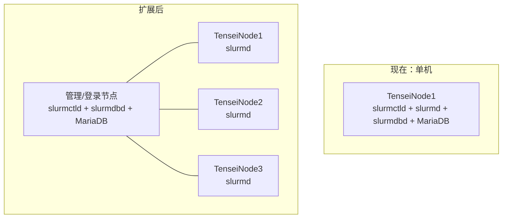

# 部署 Slurm 集群

本篇是从零搭建这套集群的完整过程。内容按实际执行顺序组织，
包含当时踩到的坑与修复方式 —— **这些坑在第二台机器上还会再遇到一次**。

!!! info "适用场景"
    从一台全新的 Ubuntu 22.04 + A100 服务器开始，
    到 `sinfo` 能列出节点、普通用户能通过 `srun` 拿到显卡为止。
    扩展到多节点见[最后一节](#9-扩展到多节点)。

## 0 前置检查

动手前先把机器的真实情况摸清楚。**这些值直接决定后面配置文件怎么写**，
猜错会导致节点起不来。

```bash
# 操作系统与内核
uname -r
cat /etc/os-release

# GPU 与驱动
nvidia-smi

# CPU 拓扑与内存
lscpu
free -h

# cgroup 模式（关键）
stat -fc %T /sys/fs/cgroup

# 主机名与解析
hostname
getent hosts TenseiNode1

# NVSwitch 管理服务（八卡机必查）
systemctl status nvidia-fabricmanager --no-pager -l

# 软件源里的 Slurm 版本
apt-cache policy slurmctld slurmd

# 是否已装过 Slurm
command -v sinfo slurmctld slurmd
```

`TenseiNode1` 的实测结果：

| 项目 | 结果 |
|---|---|
| 操作系统 | Ubuntu 22.04.4 LTS (Jammy) |
| GPU | 8 × NVIDIA A100-SXM4-80GB，驱动 `550.144.03`，CUDA `12.4` |
| CPU | 64 物理核 / **128 逻辑 CPU**（2 socket × 32 核 × 2 线程） |
| 内存 | 约 2 TiB（`slurmd -C` 报 `RealMemory=2063878` MiB） |
| cgroup | `cgroup2fs` —— **纯 cgroup v2** |
| NVSwitch | `nvidia-fabricmanager` 正常，已配置全部 GPU 与 NVSwitch 的 NVLink 路由 |
| 源内 Slurm | **只有 `21.08.5-2ubuntu1`** |

!!! danger "有 NVSwitch 就必须有 Fabric Manager"
    八卡 HGX/DGX A100 机内通过 NVSwitch 互联，**没有 Fabric Manager
    这 8 张卡无法正常做 NVLink 通信**，多卡训练会静默退化甚至报错。
    升级驱动时 Fabric Manager 版本必须**完全一致**（例如都是 `550.54.15`）。

### 关键决策：保留 cgroup v2，改用新版 Slurm

`stat -fc %T /sys/fs/cgroup` 返回 `cgroup2fs` 说明系统是纯 cgroup v2。
**Ubuntu 22.04 源里的 Slurm 21.08 不支持 cgroup v2 的资源和设备约束**，
用它就只能退回到「`--gres` 只是记账、用户仍能直接占卡」的状态。

两个选项：

| 方案 | 代价 |
|---|---|
| 内核切回 cgroup v1 | 改内核启动参数 + 重启；Ubuntu 22.04 已默认 v2，回退是逆潮流 |
| **从源码构建新版 Slurm** | 需要装编译依赖，首次构建约十几分钟 |

**选择后者。** 详见[为什么必须 cgroup v2](#为什么必须-cgroup-v2)。

## 1 安装编译依赖

### 第一批：基础工具

```bash
apt-get update
```

```bash
apt-get install -y \
  build-essential pkg-config \
  curl ca-certificates bzip2 \
  munge libmunge-dev \
  libhwloc-dev libnuma-dev \
  libdbus-1-dev libbpf-dev \
  libssl-dev libpam0g-dev \
  libreadline-dev libncurses-dev \
  libjson-c-dev libhttp-parser-dev libjwt-dev \
  debhelper devscripts fakeroot
```

!!! tip "`libdbus-1-dev` 与 `libbpf-dev` 是 cgroup v2 的门槛"
    cgroup v2 的设备和资源限制依赖 DBus 与 eBPF，
    这两个包不装，编译出来的 Slurm 在 cgroup v2 上会缺少约束能力。

装完立刻验证 MUNGE（Slurm 的认证组件，后面所有节点都要能互相认证）：

```bash
systemctl enable --now munge
munge -n | unmunge
# 期望：STATUS: Success (0)
```

!!! danger "MUNGE 不通，Slurm 一定不通"
    `munge -n | unmunge` 报错说明密钥或服务有问题。
    常见原因是 `/etc/munge/munge.key` 权限不对（必须是 `400 munge:munge`）。
    **多节点集群里所有节点的 munge key 必须相同。**

### 第二批：官方打包依赖（会失败，但要知道为什么）

```bash
apt-get install -y equivs

mk-build-deps --install --remove \
  --tool 'apt-get -y --no-install-recommends' \
  debian/control
```

这条会失败并报：

```text
mk-build-deps: Unable to install all build-dep packages
```

!!! note "这不是致命错误"
    日志里的 `The package has been created` 指的是临时的「依赖清单包」，
    APT 随后把它移除了。**真正的问题在下一节的 `dpkg-checkbuilddeps` 里。**

### 第三批：查出真正缺什么

```bash
cd /root/slurm-build/slurm-25.11.8

# 列出缺少的构建依赖
dpkg-checkbuilddeps
```

输出：

```text
dpkg-checkbuilddeps: error: Unmet build dependencies: dh-exec hdf5-helpers libcurl4-openssl-dev libfreeipmi-dev libgtk2.0-dev libhdf5-dev libipmimonitoring-dev liblua5.3-dev liblz4-dev libmariadb-dev | libmysqlclient-dev libperl-dev libpmix-dev librdkafka-dev librrd-dev libyaml-dev man2html-base
```

```bash
apt-get install \
  dh-exec hdf5-helpers \
  libcurl4-openssl-dev libfreeipmi-dev libgtk2.0-dev \
  libhdf5-dev libipmimonitoring-dev liblua5.3-dev \
  liblz4-dev libmariadb-dev libperl-dev libpmix-dev \
  librdkafka-dev librrd-dev libyaml-dev man2html-base
```

### 坑：ICU 版本冲突

上面这条会失败：

```text
The following packages have unmet dependencies:
 libicu-dev : Depends: libicu70 (= 70.1-2) but 70.1-2ubuntu1 is to be installed
E: Unable to correct problems, you have held broken packages.
```

**原因**：`libicu-dev` 要求 `libicu70` 的版本**精确等于** `70.1-2`，
但系统预装的是带 Ubuntu 补丁的 `70.1-2ubuntu1`。两者不匹配。

先诊断：

```bash
dpkg --audit
apt-cache policy libicu-dev libicu70
apt-mark showhold
grep -RHE '^[[:space:]]*(deb |Types:|URIs:|Suites:|Components:)' \
  /etc/apt/sources.list /etc/apt/sources.list.d/
```

!!! tip "改版本前先用 `-s` 模拟"
    `apt-get -s` 只做依赖求解并打印计划，不实际改动系统。
    **这是避免把系统搞坏的最重要习惯。**

```bash
apt-get -s install \
  libicu70=70.1-2 \
  libicu-dev=70.1-2 \
  icu-devtools=70.1-2
```

确认计划是「2 新增 / 1 降级 / 0 删除」后再执行：

```bash
apt-get install \
  libicu70=70.1-2 \
  libicu-dev=70.1-2 \
  icu-devtools=70.1-2
```

!!! warning "降级 `libicu70` 的影响范围"
    它还回去的是 Ubuntu 的补丁版本。这台机器上除 Slurm 构建外没有其他依赖
    ICU 补丁的服务，所以可接受。**在生产环境里做版本降级前，
    先确认没有其他软件依赖被降级版本。**

然后重装缺失依赖并确认：

```bash
apt-get install \
  dh-exec hdf5-helpers \
  libcurl4-openssl-dev libfreeipmi-dev libgtk2.0-dev \
  libhdf5-dev libipmimonitoring-dev liblua5.3-dev \
  liblz4-dev libmariadb-dev libperl-dev libpmix-dev \
  librdkafka-dev librrd-dev libyaml-dev man2html-base

cd /root/slurm-build/slurm-25.11.8
dpkg-checkbuilddeps && echo "BUILD DEPS OK"
```

看到 `BUILD DEPS OK` 才可以继续。

!!! danger "装依赖时如果提示要删除 NVIDIA / CUDA / Fabric Manager 包，立刻输入 `n`"
    这些包被误删会导致 8 张卡全部不可用，恢复代价很高。
    把输出贴出来单独分析。

## 2 下载源码并编译

```bash
mkdir -p /root/slurm-build
cd /root/slurm-build

curl -fL --retry 3 \
  -o slurm-25.11.8.tar.bz2 \
  https://download.schedmd.com/slurm/slurm-25.11.8.tar.bz2

tar -xjf slurm-25.11.8.tar.bz2
cd slurm-25.11.8
```

### 编译

!!! info "不需要 `./configure`"
    这里走的是 Debian 打包路径，`debuild` 会自动完成配置、编译、打包。
    想手工控制编译选项才需要 `./configure`。

```bash
cd /root/slurm-build/slurm-25.11.8

set -o pipefail
debuild -b -uc -us -j16 2>&1 | tee /root/slurm-build/build-25.11.8.log
```

| 参数 | 含义 |
|---|---|
| `-b` | 只构建二进制包（不构建源码包） |
| `-uc` / `-us` | 不签名 `.changes` / `.dsc`（本地构建不需要 GPG） |
| `-j16` | 16 路并行编译 |

完成后确认：

```bash
echo "BUILD EXIT: $?"
ls -1 /root/slurm-build/*.deb | wc -l
```

!!! tip "构建一次会产出 17 个包"
    包括 `slurm-smd`、`slurm-smd-client`、`slurm-smd-slurmctld`、
    `slurm-smd-slurmd`、`slurm-smd-slurmdbd` 等。
    **全部保留**，扩容新节点时直接复用，不用重新编译。

### 安装

```bash
cd /root/slurm-build

apt-get install \
  ./slurm-smd_25.11.8-1_amd64.deb \
  ./slurm-smd-client_25.11.8-1_amd64.deb \
  ./slurm-smd-slurmctld_25.11.8-1_amd64.deb \
  ./slurm-smd-slurmd_25.11.8-1_amd64.deb
```

| 包 | 作用 | 装在哪 |
|---|---|---|
| `slurm-smd` | 公共库与基础文件 | 所有节点 |
| `slurm-smd-client` | `sinfo` / `squeue` / `sbatch` 等客户端命令 | 所有节点 + 登录节点 |
| `slurm-smd-slurmctld` | 调度控制器 | **仅控制节点** |
| `slurm-smd-slurmd` | 计算节点守护进程 | **所有计算节点** |
| `slurm-smd-slurmdbd` | 记账守护进程 | 仅记账节点（见[记账](accounting.md)） |

!!! note "安装时出现 `_apt` 无法读取 `/root` 下文件的提示是正常的"
    类似 `N: Download is performed unsandboxed as root ... couldn't be accessed by user '_apt'`。
    **这不是失败** —— APT 已经用 root 完成了安装。

## 3 准备账户与目录

Slurm 需要一个专用的系统账户 `slurm`，以及几个状态和日志目录，
**属主权限写错会导致服务起不来**。

```bash
getent passwd slurm >/dev/null || \
  useradd --system --user-group --home-dir /nonexistent --shell /usr/sbin/nologin slurm

install -d -m 0755 /etc/slurm
cp -a /etc/slurm "/root/slurm-config-backup-$(date +%Y%m%d-%H%M%S)"

install -d -o slurm -g slurm -m 0755 /var/spool/slurmctld /var/log/slurm
install -d -o root  -g root  -m 0755 /var/spool/slurmd
```

| 目录 | 属主 | 为什么要这个属主 |
|---|---|---|
| `/var/spool/slurmctld` | `slurm:slurm` | 控制器以 `slurm` 身份写状态文件 |
| `/var/log/slurm` | `slurm:slurm` | 日志由 `slurm` 身份写 |
| `/var/spool/slurmd` | `root:root` | `slurmd` 以 root 运行（要创建任务 cgroup） |

!!! danger "`SlurmdSpoolDir` 必须是 root 属主"
    `slurmd` 需要 root 权限创建 cgroup 和挂载设备。
    把它设成 `slurm:slurm` 会导致任务启动失败。

## 4 写配置

**先用 `slurmd -C` 拿到机器的真实参数**，不要凭猜测填：

```bash
slurmd -C
```

输出：

```text
NodeName=TenseiNode1 CPUs=128 Boards=1 SocketsPerBoard=2 CoresPerSocket=32 ThreadsPerCore=2 RealMemory=2063878 Gres=gpu:nvidia_a100-sxm4-80gb:8
Found gpu:nvidia_a100-sxm4-80gb:8 with Autodetect=nvidia (Substring of gpu name may be used instead)
```

!!! warning "`RealMemory` 不能直接用实测值"
    `2063878` 是物理内存。全部划给任务会让节点在压力下 OOM。
    配置里下调到 **`2000000`**，留出约 62 GiB 给系统、`slurmd`、文件缓存和监控。

### `/etc/slurm/slurm.conf`

```bash
cat > /etc/slurm/slurm.conf <<'EOF'
ClusterName=tensei
SlurmctldHost=TenseiNode1
SlurmUser=slurm
AuthType=auth/munge
CredType=cred/munge

StateSaveLocation=/var/spool/slurmctld
SlurmdSpoolDir=/var/spool/slurmd
SlurmctldLogFile=/var/log/slurm/slurmctld.log
SlurmdLogFile=/var/log/slurm/slurmd.log

SchedulerType=sched/backfill
SelectType=select/cons_tres
SelectTypeParameters=CR_CPU_Memory

ProctrackType=proctrack/cgroup
TaskPlugin=task/cgroup,task/affinity
JobAcctGatherType=jobacct_gather/cgroup
JobAcctGatherFrequency=30
ReturnToService=2

GresTypes=gpu
NodeName=TenseiNode1 CPUs=128 Boards=1 SocketsPerBoard=2 CoresPerSocket=32 ThreadsPerCore=2 RealMemory=2000000 Gres=gpu:a100:8 State=UNKNOWN
PartitionName=gpu Nodes=TenseiNode1 Default=YES DefaultTime=01:00:00 MaxTime=7-00:00:00 DefMemPerCPU=4096 OverSubscribe=NO State=UP
EOF
```

各参数的作用与取舍见[调度策略与配额](policy.md#关键配置解析)。

### `/etc/slurm/gres.conf`

```bash
cat > /etc/slurm/gres.conf <<'EOF'
AutoDetect=nvidia
Name=gpu Type=a100 File=/dev/nvidia[0-7]
EOF
```

### `/etc/slurm/cgroup.conf`

```bash
cat > /etc/slurm/cgroup.conf <<'EOF'
CgroupPlugin=cgroup/v2
ConstrainCores=yes
ConstrainRAMSpace=yes
ConstrainDevices=yes
EOF

chmod 644 /etc/slurm/slurm.conf /etc/slurm/gres.conf /etc/slurm/cgroup.conf
```

!!! danger "`ConstrainDevices=yes` 不能省"
    没有它，`--gres=gpu:1` 只是记账，程序仍然能看到并占用全部 8 张卡。
    这一行让限制落到内核设备访问控制上。

### 为什么必须 cgroup v2

| 能力 | cgroup v1（Slurm 21.08） | cgroup v2（Slurm 25.11） |
|---|---|---|
| 限制 CPU 核 | ✅ | ✅ |
| 限制内存 | ✅ | ✅ |
| **限制设备（GPU）访问** | 有限 | ✅ 完整 |
| 内存峰值统计 | 需要额外插件 | ✅ `jobacct_gather/cgroup` 原生支持 |

!!! info "`cgroup.conf` 里没有 `/dev/nvidia*` 白名单"
    设备限制不是靠手写允许列表，而是靠
    `gres.conf` 的 `File=/dev/nvidia[0-7]` 与 `task/cgroup` 插件配合：
    任务被分配哪几张卡，cgroup 就只放通哪几个设备节点。
    **手写白名单反而容易漏掉 `/dev/nvidiactl`、`/dev/nvidia-uvm` 这些必要设备。**

检查插件是否可用：

```bash
find /usr/lib /usr/lib64 -type f \
  \( -name 'cgroup_v2.so' -o -name 'gpu_nvml.so' -o -name 'gpu_nvidia.so' \) \
  2>/dev/null
```

装好的是 `cgroup_v2.so` 与 `gpu_nvidia.so`。

!!! note "没有 `gpu_nvml.so` 意味着什么"
    当前用 `AutoDetect=nvidia` 做整卡分配，够用。
    但**不支持 MIG，也不做 NVLink 拓扑感知**。
    `slurmd -G` 输出里的 `Links=(null)` 是插件没检测拓扑，**不是 NVLink 故障**。
    需要这些能力时再引入 NVML 支持。

### 验证 GRES 识别

```bash
slurmd -G
```

应输出 8 条记录：

```text
Gres Name=gpu Type=a100 Count=1 Index=0 ID=7696487 File=/dev/nvidia0 Cores=0-31 CoreCnt=128 Links=(null) Flags=HAS_FILE,HAS_TYPE,ENV_NVML
...
Gres Name=gpu Type=a100 Count=1 Index=7 ID=7696487 File=/dev/nvidia7 Cores=32-63 CoreCnt=128 Links=(null) Flags=HAS_FILE,HAS_TYPE,ENV_NVML
```

## 5 启动服务

```bash
systemctl enable --now munge
systemctl enable --now slurmctld slurmd

systemctl is-active munge slurmctld slurmd
sinfo
```

`sinfo` 正常输出类似：

```text
PARTITION AVAIL  TIMELIMIT  NODES  STATE NODELIST
gpu*         up   7-00:00:00      1   idle TenseiNode1
```

!!! note "第一次 `sinfo` 可能报 DNS 错误"
    如果还没写 `slurm.conf`，客户端会去 DNS 找控制节点：

    ```text
    sinfo: error: resolve_ctls_from_dns_srv: res_nsearch error: Unknown host
    sinfo: error: fetch_config: DNS SRV lookup failed
    sinfo: error: _slurm_connect: Unable to contact slurm controller
    ```

    **这不是 DNS 问题，也不用改 DNS 或重装。**
    原因是缺少 `/etc/slurm/slurm.conf`，客户端找不到控制节点地址。
    写好配置后这个报错自然消失。

### 节点状态不是 `idle` 怎么办

| 状态 | 原因 | 处理 |
|---|---|---|
| `down` | `slurmd` 没起来 | `systemctl status slurmd`、`journalctl -u slurmd -n 50` |
| `drain` | 之前故障被标记，需人工确认 | `scontrol update NodeName=TenseiNode1 State=RESUME` |
| `unknown` | `slurmctld` 还没收到 `slurmd` 注册 | 等几秒，或重启 `slurmd` |
| `mixed` / `alloc` | 有任务在跑 | 正常 |

```bash
scontrol show node TenseiNode1
systemctl status slurmd --no-pager -l
journalctl -u slurmd -n 50 --no-pager
tail -n 60 /var/log/slurm/slurmd.log
```

## 6 验证集群可用

!!! tip "验证要覆盖三件事"
    服务是否起来、节点是否识别到资源、任务是否真能拿到**且只能拿到**分配的卡。
    只测第一条会漏掉最常见的配置错误。

### 节点资源

```bash
sinfo -N -l
scontrol show node TenseiNode1
```

应显示 8 张 A100、128 个 CPU、约 2,000,000 MiB 内存。

### 单卡任务

用普通用户身份测（**不要一直用 root**）：

```bash
srun -N 1 -n 1 --gres=gpu:1 \
  --cpus-per-task=2 --mem=2G --time=00:02:00 \
  bash -c 'hostname; echo "CUDA_VISIBLE_DEVICES=$CUDA_VISIBLE_DEVICES"; nvidia-smi -L'
```

预期：任务内**只看到一张** A100。

### 隔离验证

```bash
runuser -l chao -c \
  'srun -A research -p gpu --immediate=10 \
        --gres=gpu:1 -N1 -n1 \
        --cpus-per-task=1 --mem=1G --time=00:01:00 \
        bash -c "cat /proc/self/cgroup; nvidia-smi -L"'
```

预期输出：

```text
GPU 0: NVIDIA A100-SXM4-80GB (UUID: GPU-a0276972-3de5-c07b-0c2f-bcc0084566b7)
```

!!! success "任务内 `GPU 0` 而不是 `GPU 3` 才是对的"
    Slurm 会把分配给任务的卡重新编号并从 0 开始，
    同时用 cgroup 限制设备可见性。看到 `GPU 0` 说明隔离生效。

### 确认任务到物理卡的映射

```bash
scontrol show job -d <JOBID> | grep -E 'JOB_GRES|Nodes=|UserId='
```

```text
   JOB_GRES=gpu:a100:1
     Nodes=TenseiNode1 CPU_IDs=0-1 Mem=1024 GRES=gpu:a100:1(IDX:0)
   UserId=chao(1000) GroupId=chao(1000) MCS_label=N/A
```

`(IDX:0)` 就是物理 GPU 索引，这是后来做「哪张卡属于谁」监控的关键字段。

## 7 常见错误速查

| 错误 | 根因 | 修复 |
|---|---|---|
| `mk-build-deps: Unable to install all build-dep packages` | 依赖求解失败 | 改用 `dpkg-checkbuilddeps` 逐项排查 |
| `libicu-dev : Depends: libicu70 (= 70.1-2) but 70.1-2ubuntu1 is to be installed` | ICU 版本不匹配 | `apt-get install libicu70=70.1-2 libicu-dev=70.1-2 icu-devtools=70.1-2` |
| `resolve_ctls_from_dns_srv: res_nsearch error: Unknown host` | 还没有 `slurm.conf` | 写配置文件，**不要动 DNS** |
| `error: Configured MailProg is invalid` | 没有可用 MTA | **不影响运行**，见[邮件通知](accounting.md#邮件通知未配置) |
| `Unable to open pidfile '/var/run/slurmdbd.pid': Permission denied` | `slurmdbd` 无权写 `/var/run` | systemd drop-in 加 `RuntimeDirectory`，见[记账](accounting.md#修正-pid-文件路径) |
| `Database settings not recommended values` | MariaDB 参数用默认值 | 写 `/etc/mysql/mariadb.conf.d/60-slurm.cnf` |
| `fatal: CLUSTER ID MISMATCH` | 控制器状态与记账库的集群 ID 不一致 | 移走 `/var/spool/slurmctld/clustername`，见[记账](accounting.md#故障处理cluster-id-mismatch) |
| `Unable to contact slurm controller (connect failure)` | `slurmctld` 没在跑 | `systemctl status slurmctld` + `journalctl`，通常是上一个错误的表象 |
| `N: Download is performed unsandboxed as root` | APT 的 `_apt` 用户读不了 `/root` | **无害**，安装已完成 |

!!! danger "排查顺序：先看服务，再看日志，最后看配置"
    `slurm_load_partitions: Unable to contact slurm controller` 这类错误
    **只是表象**。真正的原因在 `slurmctld` 的日志里。

    ```bash
    systemctl status slurmctld --no-pager -l
    journalctl -u slurmctld --since "10 minutes ago" -n 100 --no-pager
    tail -n 60 /var/log/slurm/slurmctld.log
    ss -lntp | grep -E ':(6817|6819)\b'
    ```

## 8 清理与保留

!!! danger "构建目录可以删，安装包不能删"
    第一次部署后删掉了 `/root/slurm-build`，
    结果后来要装 `slurmdbd` 时发现包也没了，**只能重新下载源码重编译一遍**。

**该保留的：**

```bash
mkdir -p /root/slurm-packages/25.11.8
cp -av /root/slurm-build/*.deb /root/slurm-packages/25.11.8/
```

| 保留内容 | 原因 |
|---|---|
| `/root/slurm-packages/25.11.8/*.deb` | 扩容新节点、补装组件时直接用 |
| `/etc/slurm/` | 配置，必须备份 |
| `/var/spool/slurmctld` | 调度状态（含排队作业） |
| `/var/spool/slurmd` | 计算节点运行数据 |
| `/var/log/slurm` | 日志 |

**可以删的：**

```bash
cd /root
rm -rf -- /root/slurm-build
```

!!! warning "暂时不要执行 `apt autoremove`"
    它会清掉被认为「不再需要」的构建依赖，
    而下次编译或补装组件时又要重新装一遍。

## 9 扩展到多节点

当前控制服务与计算服务在同一台机器上。扩到 2～5 台时不需要推倒重来。

### 架构演进



!!! tip "只有一台时不用急着拆分"
    控制服务与计算共机在单节点阶段完全可行。
    扩到多台后再把 `slurmctld` 独立出来，运维上更清晰。

### 新节点接入清单

**1. 统一基础环境**（这一步做不对，后面全是玄学问题）：

| 项目 | 要求 |
|---|---|
| 操作系统版本 | 与现有节点一致 |
| NVIDIA 驱动 + Fabric Manager | **版本完全一致** |
| 主机名与 hosts 解析 | 所有节点能互相解析 |
| **UID / GID** | 所有节点上同一用户必须 UID 相同 |
| MUNGE key | `/etc/munge/munge.key` 所有节点**完全相同** |
| 共享目录 | `/home` 通过 NFS 等共享，代码与数据路径一致 |

**2. 安装 Slurm 包**（复用已构建的 `.deb`，不用重新编译）：

```bash
# 把包和配置从现有节点拷过去
scp /root/slurm-packages/25.11.8/slurm-smd*.deb newnode:/root/

# 在新节点上
apt-get install /root/slurm-smd_25.11.8-1_amd64.deb \
                /root/slurm-smd-client_25.11.8-1_amd64.deb \
                /root/slurm-smd-slurmd_25.11.8-1_amd64.deb
```

**3. 在 `slurm.conf` 中登记新节点**：

```bash
NodeName=TenseiNode2 CPUs=128 Boards=1 SocketsPerBoard=2 CoresPerSocket=32 ThreadsPerCore=2 RealMemory=2000000 Gres=gpu:a100:8 State=UNKNOWN
PartitionName=gpu Nodes=TenseiNode1,TenseiNode2 Default=YES DefaultTime=01:00:00 MaxTime=7-00:00:00 DefMemPerCPU=4096 OverSubscribe=NO State=UP
```

**4. 把配置分发到所有节点并重载**：

```bash
# 每个节点都要有相同的 slurm.conf / gres.conf / cgroup.conf
systemctl reload slurmctld      # 控制节点
systemctl restart slurmd        # 每个计算节点
sinfo                            # 应列出所有节点
```

### 用 Ansible 批量管理

节点超过 2 台后，逐台 SSH 改配置既慢又容易漏。

| 场景 | 手工 | Ansible |
|---|---|---|
| 创建 20 个用户 | 20 × `tensei-add-user` | 一个 playbook |
| 分发 `slurm.conf` | 逐台 `scp` + 重启 | 一个 task |
| 检查服务状态 | 逐台登录 | 一条 ad-hoc 命令 |
| 安装软件包 | 逐台 `apt` | 一个 task |

推荐优先用 Ansible 做**用户创建**与**配置分发**这两件事 ——
它们最频繁，也最容易因为漏做某台而产生「同样的命令在 A 机器上能跑、B 机器上报错」的问题。

```bash
# Ansible ad-hoc 示例：一次检查所有节点的 slurmd
ansible gpu_nodes -m shell -a 'systemctl is-active slurmd && sinfo -N -l'
```

!!! note "当前是单节点，Ansible 不是阻塞项"
    但扩到 3 台以上时，它会显著降低运维成本。

### 多机训练还要额外验证

!!! danger "Slurm 装好 ≠ 多机训练能跑"
    Slurm 只负责分配多机资源，**不会自动让单机程序变成分布式程序**。
    跨机通信还依赖机间网络（InfiniBand / RoCE）、NCCL 配置与 RDMA 驱动。

扩展后必须单独验证：

```bash
# GPU 拓扑与网卡对应关系（每台机器都跑）
nvidia-smi topo -m
ibstat

# 双机 NCCL 通信测试
# 申请两台机器各 1 张卡，跑 all_reduce 基准
```

**先做双机通信与训练测试，再扩到更多节点**，确认联合运行真的提升吞吐。

## 相关文档

* [调度策略与配额](policy.md) —— `slurm.conf` 每个参数的取舍
* [记账与用量统计](accounting.md) —— `slurmdbd` + MariaDB
* [监控与可视化](monitoring.md) —— DCGM + Prometheus + Grafana
* [访问入口与安全加固](access-security.md) —— 阻止用户绕过调度器
* [用户与账号管理](users.md) —— 开户、销户与批量管理
