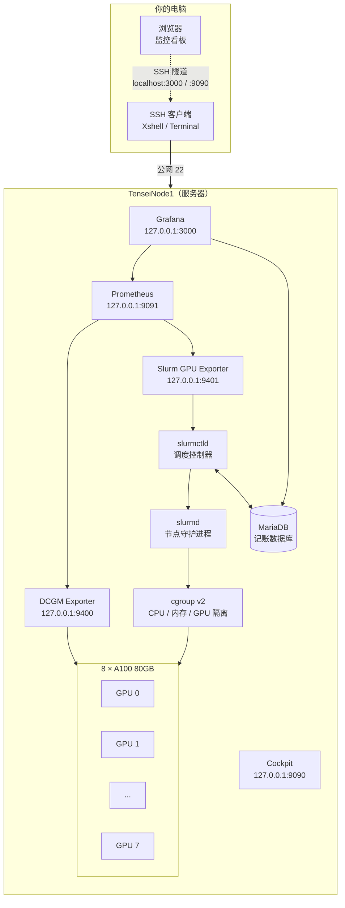

# 概述

!!! danger "请认真阅读本指南"
    这是一份 **Tensei 八卡 A100 服务器**的使用与管理文档。
    为保障服务器稳定运行与各位用户的数据安全，请在使用前认真阅读
    [使用须知](user/basis.md) 与 [Slurm 任务调度](user/slurm.md)。

!!! danger "GPU 必须通过 Slurm 申请"
    集群已启用**设备访问限制**：直接在 SSH 终端里运行 `nvidia-smi`、`python train.py`
    等命令**无法访问 GPU**，会报 `Failed to initialize NVML: Unknown Error`。
    所有需要显卡的任务都必须通过 `srun` / `sbatch` / `salloc` 提交。
    详见 [为什么必须走 Slurm](user/basis.md#为什么必须通过-slurm-使用-gpu)。

## 这份文档给谁看

文档分为两大部分，请按自己的角色查阅：

| 部分 | 读者 | 内容 |
|---|---|---|
| [用户指南](user/quickstart.md) | 所有需要使用 GPU 的成员 | 登录集群、申请显卡、提交训练任务、查看自己的用量与排队情况 |
| [管理员手册](admin/index.md) | 服务器 / 集群管理员 | 从零部署 Slurm、制定调度策略与配额、记账统计、监控告警、账号管理与安全加固 |

如果你只是要用卡跑实验，读完 **[快速开始](user/quickstart.md)** 与 **[Slurm 任务调度](user/slurm.md)** 就可以开始了。

## 集群概况

**GPU**
8 × NVIDIA A100-SXM4-80GB

**CPU**
64 物理核 / 128 逻辑 CPU

**内存**
约 2 TiB（可调度约 2,000,000 MiB）

**机内互联**
NVLink + NVSwitch（Fabric Manager 管理）

| 项目 | 当前配置 |
|---|---|
| 集群名称 | `tensei` |
| 计算节点 | `TenseiNode1`（单节点，可扩展到 1～5 台八卡机） |
| 队列（Partition） | `gpu`（默认队列） |
| 操作系统 | Ubuntu 22.04.4 LTS (Jammy) |
| 显卡驱动 | NVIDIA `550.144.03`，CUDA `12.4` |
| 调度系统 | Slurm `25.11.8`（官方源码构建） |
| 资源隔离 | cgroup v2，GPU 设备访问受控 |
| 记账数据库 | MariaDB + `slurmdbd`，账户 `research` |
| 监控 | Prometheus + DCGM Exporter + Grafana + Cockpit |
| 机间网络 | ConnectX 网卡（多机训练前需单独验证 RDMA / NCCL） |

!!! info "只有一台机器时也是集群"
    Slurm 的控制服务（`slurmctld`）与计算服务（`slurmd`）目前部署在同一台机器上。
    后续增加机器时，只需在新节点安装 `slurmd` 并在 `slurm.conf` 中登记，
    用户侧的命令与习惯**完全不变**。

## 集群架构

**任务的生命周期**：你在登录会话中提交任务 → `slurmctld` 计算优先级并排队 →
资源满足后把任务分配到 `TenseiNode1` → `slurmd` 在 cgroup 中创建受限环境并启动进程 →
任务结束，资源释放，用量写入 MariaDB 供统计查询。

## 我要做什么，该看哪一页

| 我想…… | 去看 |
|---|---|
| 第一次登录服务器 | [访问集群](user/access.md) → [快速开始](user/quickstart.md) |
| 跑一个 Python 训练脚本 | [Slurm 任务调度](user/slurm.md) → [GPU 训练实战](user/gpu-training.md) |
| 边调代码边用显卡 | [交互式任务 `srun --pty`](user/slurm.md#交互式调试srun---pty) |
| 一次提交几十组实验 | [批量任务与任务组](user/slurm.md#后台批处理sbatch-与任务组) |
| 用 8 张卡跑一个模型 | [单机多卡训练](user/gpu-training.md#单机多卡训练) |
| 用几台机器联合训练 | [多机多卡训练](user/gpu-training.md#多机多卡训练) |
| 装 PyTorch / 配虚拟环境 | [Python 环境管理](user/conda.md) |
| 看我的任务跑了多久、排队为什么慢 | [用量查询与监控](user/monitor.md) |
| 看整机 GPU 实时占用 | [Grafana 看板](user/monitor.md#grafana-看板) |
| 任务报错了 | [常见问题](user/faq.md) |
| 部署 / 维护这套集群 | [管理员手册](admin/index.md) |
| 把这个文档站发布到线上 | [部署本文档站](deploy.md) |

## 约定与术语

| 术语 | 含义 |
|---|---|
| **节点**（Node） | 一台可以独立运行程序的服务器。目前是 `TenseiNode1` |
| **队列 / 分区**（Partition） | 一组节点的集合。目前只有 `gpu`，所有 GPU 任务都提交到这里 |
| **任务**（Job） | 对「程序 + 所需资源」的封装，有唯一编号 `JOBID` |
| **GRES** | Generic RESources，通用资源。GPU 用 `--gres=gpu:N` 申请 |
| **卡时** | 分配卡数 × 占用小时数。用于统计用量，**不代表实际计算量** |
| **整卡独占** | 一张卡同一时刻只分配给一个任务，不做显存切分或 MIG |

## 更新记录

**2026.09.12**

* 完成普通 SSH 会话的 GPU 设备访问限制，用户只能通过 Slurm 使用显卡
* 建立统一的开户 / 销户流程（`tensei-add-user`）
* 确定监控页面统一通过 SSH 隧道访问，不向公网暴露额外端口
* Open OnDemand 暂停使用，网页入口暂缓开放

**2026.09.11**

* 在 `TenseiNode1` 上从源码构建并部署 Slurm `25.11.8`，保留 cgroup v2
* 完成单节点集群配置，识别 128 逻辑 CPU、约 2 TiB 内存与 8 张 A100
* 部署 MariaDB + `slurmdbd` 记账服务，创建账户 `research`
* 部署 Prometheus + DCGM Exporter + Grafana，实现 GPU 用量与用户任务对应看板
* 安装 Cockpit，用于服务状态与日志查看

## 联系管理员

* 申请账号、申请扩容、报告故障：联系集群管理员
* 发现文档错误或有改进建议：在文档仓库提交 issue 或 pull request
  （见每页右上角的编辑入口）
