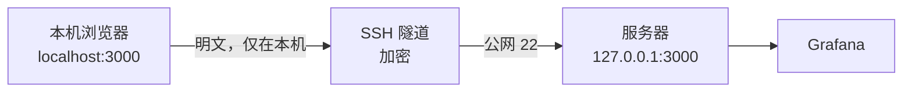

# 访问集群

本篇说明如何登录服务器，以及如何通过 SSH 隧道打开服务器上的监控面板。

## 访问前提

你需要管理员提供以下信息：

| 信息 | 说明 |
|---|---|
| 服务器公网 IP | 例如 `203.0.113.10`（下文用 `SERVER_IP` 指代） |
| SSH 端口 | 默认 `22` |
| 用户名 | 由管理员创建，例如 `zhangsan` |
| 初始密码 | 统一初始密码，**首次登录必须修改** |

!!! tip "用 SSH 密钥登录更省事"
    如果你有自己的 SSH 密钥对，可以把公钥（`id_ed25519.pub`）发给管理员配置到
    `~/.ssh/authorized_keys`，之后登录不再需要输入密码，也方便配置免密隧道。

!!! info "监控面板不需要额外开放端口"
    服务器的安全组**只需要放行 SSH 端口**。Grafana、Cockpit 等页面通过 SSH 隧道访问，
    不需要向公网开放 `3000`、`9090` 等端口，也不需要为它们单独申请域名或证书。

## 首次登录

### 用命令行登录

```bash
ssh zhangsan@SERVER_IP
```

首次连接会提示确认主机指纹，输入 `yes` 回车即可。

随后会依次要求输入：

1. **当前密码**：管理员给你的统一初始密码；
2. **新密码**：你自己的密码；
3. **确认新密码**：再输入一次。

!!! warning "改密后连接会断开"
    这是正常的。用**新密码**重新执行 `ssh zhangsan@SERVER_IP` 即可。
    密码修改只影响你自己。

### 用 Xshell 登录

国内用户常用 Xshell 管理服务器：

1. **文件 → 新建**，协议选 `SSH`；
2. **主机**填服务器公网 IP，**端口**填 `22`；
3. **用户身份验证**中填写用户名和密码；
4. 连接后按提示完成首次改密。

!!! note "目标主机填什么"
    在 Xshell 的配置项里，**「目标主机 / Host」永远是指「从服务器看过去要连接哪里」**。
    服务器上的服务都监听在 `127.0.0.1`，所以目标主机填 `127.0.0.1`，
    **不是**你 Windows 电脑的地址。这是配置隧道时最容易搞错的一点。

### 用 VS Code 远程开发

在 VS Code 中安装 **Remote - SSH** 扩展，添加主机：

```text
Host tensei
    HostName SERVER_IP
    User zhangsan
    Port 22
```

连接后即可在服务器上直接编辑代码、开终端。**注意**：VS Code 的终端同样是普通 SSH 会话，
**不能直接访问 GPU**，跑训练仍然要通过 `srun` / `sbatch`。

## 通过 SSH 隧道访问监控页面

### 为什么要用隧道

服务器上的 Grafana、Cockpit 等面板如果直接暴露到公网，会带来两个问题：

* **安全风险**：面板本身有登录页，但暴露在公网会持续被扫描和爆破；
* **证书问题**：用 IP 访问无法申请受信任的 HTTPS 证书，浏览器会持续告警。

SSH 隧道把远程端口映射到**你本机**，流量全程由 SSH 加密，
服务器只需要开放 `22` 一个端口。



### 方式一：Xshell 配置隧道

打开服务器会话的 **属性 → 连接 → SSH → 隧道**，添加以下规则：

| 配置项 | Grafana 监控 | Cockpit 管理 |
|---|---|---|
| 类型 | Local（本地） | Local（本地） |
| 本地监听地址 | `127.0.0.1` | `127.0.0.1` |
| 本地端口 | `3000` | `9090` |
| 目标主机 | `127.0.0.1` | `127.0.0.1` |
| 目标端口 | `3000` | `9090` |

保存后**重新连接** SSH，隧道即生效。**访问期间保持 Xshell 会话连接**，
会话断开则隧道失效。

### 方式二：命令行隧道

在 macOS / Linux / Windows Terminal 中执行：

```bash
# 一条命令同时转发 Grafana 和 Cockpit
ssh -N \
  -L 3000:127.0.0.1:3000 \
  -L 9090:127.0.0.1:9090 \
  zhangsan@SERVER_IP
```

参数说明：

| 参数 | 作用 |
|---|---|
| `-N` | 只建立隧道 |
| `-L 本地端口:目标主机:目标端口` | 把本机端口转发到服务器上的目标地址 |
| `-f` | （可选）让隧道转到后台运行 |

也可以写进 `~/.ssh/config`，之后一条 `ssh tensei-tunnel` 就能建立：

```text
Host tensei-tunnel
    HostName SERVER_IP
    User zhangsan
    LocalForward 3000 127.0.0.1:3000
    LocalForward 9090 127.0.0.1:9090
    ExitOnForwardFailure yes
```

### 隧道建立后的访问地址

| 页面 | 本机浏览器地址 | 登录方式 | 用途 |
|---|---|---|---|
| Grafana 监控 | `http://localhost:3000` | Grafana 独立账号 | GPU 用量统计、实时占用、用户与任务对应 |
| Cockpit 管理 | `https://localhost:9090` | 服务器 Linux 账号 | 服务状态、日志、系统资源 |

!!! note "Grafana 账号和 Linux 账号是两套"
    Grafana 有独立的用户体系，SSH 能登录**不代表**能登录 Grafana。
    需要看板权限请联系管理员开通。

!!! warning "Cockpit 提示证书不受信任"
    这是自签名证书的正常提示。确认地址是 `https://localhost:9090`、且隧道目标正确后，
    选择继续访问即可。

!!! note "HTTP 会不会不安全"
    Grafana 使用的是 HTTP，但浏览器连接的是**你本机的隧道入口**，
    从你的电脑到服务器之间的这段链路由 SSH 加密，公网上传输的是密文。

## 端口与安全组

服务器上的服务**全部只监听 `127.0.0.1`**，也就是说它们本来就只能从服务器本机访问。
SSH 隧道的作用就是把它们安全地「搬」到你的浏览器里。

| 端口 | 服务 | 是否需要向公网开放 |
|---|---|---|
| `22` | SSH | ✅ **需要**，这是唯一的公网入口 |
| `3000` | Grafana | ❌ 不需要，走 SSH 隧道 |
| `9090` | Cockpit | ❌ 不需要，走 SSH 隧道 |
| `9091` | Prometheus | ❌ 不需要，走 SSH 隧道（一般直接用 Grafana 看） |
| `9400` / `9401` | DCGM Exporter / Slurm GPU Exporter | ❌ 不需要，由 Prometheus 在本机抓取 |
| `80` / `443` | Open OnDemand（暂停使用） | ❌ 当前不开放 |
| `6817` / `6819` | Slurm 控制器 / 记账服务 | ❌ **绝对不要**向公网开放 |
| `3306` | MariaDB | ❌ **绝对不要**向公网开放 |

!!! danger "只开放 22 端口"
    `6817`、`6819`、`3306` 是集群内部端口。把它们暴露到公网等于把调度系统和
    数据库直接交给互联网，任何人都能提交任务或读取记账数据。

!!! question "一定要有公网 IP 吗"
    是的，服务器需要一个可被访问的公网 IP 才能远程登录。但**有了公网 IP 也不等于要开放所有端口** —
    只放行 SSH，其余服务全部走隧道，这是最省事也最安全的方式。

## 常见问题

| 现象 | 检查方法 |
|---|---|
| SSH 连接超时 | 确认公网 IP 正确、安全组已放行 `22`、本机网络能出网 |
| SSH 能登录，页面打不开 | 确认隧道已建立（Xshell 会话说保持连接，或 `ssh -N` 进程还在） |
| 提示本地端口被占用 | 把本地端口改成 `13000` / `19090`，**目标端口保持不变**，浏览器用改后的端口 |
| 页面能打开，Grafana 登录失败 | Grafana 账号与 Linux 账号是两套，联系管理员开通 |
| 终端里 `nvidia-smi` 报错 | 这是**预期行为**，说明设备隔离生效了，请通过 Slurm 申请 GPU |
| 图表没有较早的数据 | 历史指标从监控上线时开始积累，约保留 30 天 |

管理员可在服务器上检查相关服务是否正常：

```bash
systemctl is-active \
  grafana-server cockpit.socket prometheus \
  dcgm-exporter slurm-gpu-exporter
```
