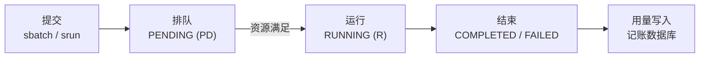

# Slurm 任务调度

!!! tip "Slurm 是什么"
    **Slurm**（Simple Linux Utility for Resource Management）是全球超算与 GPU 集群
    最广泛使用的开源任务调度系统。它做三件事：

    1. **分配资源**：决定谁在什么时候、用哪些机器和哪些显卡；
    2. **启动与监控任务**：在分配好的资源上拉起你的进程，并限制它只能用这些资源；
    3. **排队**：资源不够时把任务放进队列，按优先级和空闲情况调度。

    关键认知：**Slurm 不参与你的程序内部逻辑**。任何能在 Linux 上跑的程序都能交给 Slurm，
    它只负责「在哪跑、能用多少资源、能跑多久」。

## 核心概念

先建立四个概念，后面的命令就都好理解了。

### 节点：机器

**节点（Node）** 是一台能独立运行程序的服务器。当前集群只有一个计算节点 `TenseiNode1`，
配备 8 张 A100。用 `sinfo` 查看：

```bash
sinfo -N -l
```

### 队列：任务的分区

**队列（Partition）** 是节点的分组，决定任务排到哪里、最久能跑多久。
本集群只有一个队列 `gpu`，它也是**默认队列**，所以提交时不需要写 `-p gpu`。

### 任务：程序 + 资源申请

**任务（Job）** 是对「程序」加上「所需资源」的封装。每个任务有唯一编号 `JOBID`。
一个任务被创建后，生命周期如下：



### 资源：申请多少，就只能用多少

任务运行时被 cgroup 限制在申请的资源内：

| 资源 | 申请参数 | 说明 |
|---|---|---|
| GPU | `--gres=gpu:N` | 整卡独占，**不申请就拿不到** |
| CPU | `--cpus-per-task=N` | 逻辑 CPU 数量 |
| 内存 | `--mem=32G` | **主机内存**，不是显存 |
| 时间 | `--time=04:00:00` | 到点强制终止 |

!!! danger "资源必须先申请，不能「先跑了再说」"
    没有申请 GPU 的任务**看不到任何显卡**。
    申请了 1 张卡的任务也**不可能**看到其余 7 张，
    即使那 7 张当时完全空闲。

## 本集群的调度策略

!!! info "这些参数来自 `slurm.conf`，会随管理员调整而变化"
    如果发现实际行为与此处描述不一致，以 `scontrol show partition gpu` 的输出为准。

| 项目 | 当前值 |
|---|---|
| 集群 / 节点 | `tensei` / `TenseiNode1` |
| 队列 | `gpu`（默认队列） |
| GPU 分配 | 8 张 A100，**整卡独占**；不同任务可用不同卡 |
| 单任务 GPU 上限 | 8 张（整机），没有额外限制 |
| CPU | 128 个逻辑 CPU，按逻辑核分配 |
| 可调度内存 | 约 `2,000,000 MiB`（为系统预留约 62 GiB） |
| 默认内存 | 每个 CPU 默认 `4096 MiB`，可用 `--mem` 覆盖 |
| 默认时限 | 不写 `--time` 时 **1 小时** |
| 最长时限 | **7 天**，到时终止 |
| 调度算法 | **Backfill（回填）**：短任务可利用空档，前提是不推迟已排队的高优先级任务 |
| 资源隔离 | CPU、内存、GPU 设备访问均由 cgroup v2 约束 |

**Backfill 的实用含义**：如果你申请 30 分钟的小任务，即使前面排着一个 8 卡的大任务，
只要小任务能在空档里跑完，它就**可能插队先跑**。所以**如实填写 `--time` 能显著减少排队**，
把时间写虚高只会让自己排得更久。

!!! warning "当前没有启用的策略"
    以下功能**尚未配置**，不要假设它们生效：

    * 每用户 / 每项目的 GPU 总上限与公平份额
    * 抢占（不会为新任务赶走正在运行的任务）
    * 显存配额或 GPU 切分（整卡独占，`--mem` 限的是主机内存）

## 三种提交方式

| 命令 | 用途 | 是否阻塞终端 |
|---|---|---|
| `srun` | 前台运行，输出直接打在终端上 | ✅ 阻塞，`Ctrl+C` 可中断 |
| `sbatch` | 后台批处理，提交后立刻返回 | ❌ 不阻塞，适合长任务 |
| `salloc` | 只申请资源，拿到一个 shell 后自己决定跑什么 | ✅ 进入新 shell |

一句话选择：**调试用 `srun`，正式跑用 `sbatch`，想反复试手用 `salloc`。**

## 交互式调试：`srun --pty`

最常用的场景：申请一张卡，进去改代码、跑几轮试试。

```bash
srun --gres=gpu:1 --cpus-per-task=8 --mem=32G \
     --time=01:00:00 --pty bash
```

| 参数 | 说明 |
|---|---|
| `--gres=gpu:1` | 申请 1 张 GPU |
| `--cpus-per-task=8` | 申请 8 个逻辑 CPU |
| `--mem=32G` | 申请 32 GiB 主机内存 |
| `--time=01:00:00` | 最长 1 小时，到点自动终止 |
| `--pty bash` | 分配一个伪终端并启动 bash |

资源满足时你会立刻进入新 shell；不满足则会**排队等待**，直到拿到资源才进入。

!!! danger "交互式任务从「进入」那一刻开始计时"
    申请 8 小时然后去吃饭，这 8 小时里卡是锁住的，别人用不了。
    请按实际需要填写 `--time`，调试完立刻 `exit`。

!!! tip "不想干等：加 `--immediate`"
    ```bash
    srun --gres=gpu:1 --time=00:30:00 --immediate=10 --pty bash
    ```
    `--immediate=10` 表示「10 秒内拿不到资源就报错退出」，而不是无限排队。
    适合脚本化的自检，例如登录后快速确认隔离是否生效。

进入任务后验证显卡：

```bash
nvidia-smi -L          # 只列出分配给本任务的卡
echo "$CUDA_VISIBLE_DEVICES"
python -c "import torch; print(torch.cuda.device_count())"
```

## 前台运行：`srun`

`srun` 也可以直接跑命令，输出打在终端上：

```bash
srun --gres=gpu:1 --time=00:10:00 python -u train.py
```

程序结束后自动释放资源、退出。适用于十分钟内能跑完的验证。

## 后台批处理：`sbatch` 与任务组

### 最小可用的提交脚本

创建 `train.sh`：

```bash
#!/bin/bash
#SBATCH --job-name=train
#SBATCH --gres=gpu:1
#SBATCH --cpus-per-task=8
#SBATCH --mem=32G
#SBATCH --time=04:00:00
#SBATCH --output=logs/%j.out
#SBATCH --error=logs/%j.err

mkdir -p logs
python -u train.py
```

提交与查看：

```bash
sbatch train.sh
# Submitted batch job 123

squeue -u "$USER"
tail -f logs/123.out
```

!!! danger "`#SBATCH` 行必须连续，且必须在脚本最前面"
    在所有 `#SBATCH` 行之前或之间插入普通命令（`echo`、变量赋值等），
    后面的 `#SBATCH` 就会被当成普通注释**静默忽略**，任务会用默认资源跑起来。

### 常用 `#SBATCH` 参数

| 参数 | 含义 | 示例 |
|---|---|---|
| `--job-name` | 任务名，显示在 `squeue` 的 `NAME` 列 | `--job-name=llama-ft` |
| `--gres` | 申请的 GPU 数量 | `--gres=gpu:4` |
| `--cpus-per-task` | 申请的 CPU 数 | `--cpus-per-task=32` |
| `--mem` | 申请的主机内存 | `--mem=256G` |
| `--time` | 最长运行时间 | `--time=2-12:00:00` |
| `--output` / `--error` | 标准输出 / 错误输出文件 | `--output=logs/%j.out` |
| `--array` | 提交任务组 | `--array=0-9` |
| `--nodelist` | 指定节点 | `--nodelist=TenseiNode1` |
| `--begin` | 延迟启动 | `--begin=22:00:00` |
| `--dependency` | 依赖其他任务 | `--dependency=afterok:123` |
| `--mail-type` / `--mail-user` | 邮件通知（需配置邮件服务） | `--mail-type=END` |

### `--time` 的写法

| 写法 | 含义 |
|---|---|
| `--time=30` | 30 **分钟** |
| `--time=04:00:00` | 4 小时 |
| `--time=1-00:00:00` | 1 天 |
| `--time=2-12:30:00` | 2 天 12 小时 30 分 |
| `--time=0` | 不限时（**受队列上限 7 天约束**） |

### 输出占位符

| 占位符 | 含义 |
|---|---|
| `%j` | 任务号 `JOBID` |
| `%A` | 任务组号 `ARRAYJOBID` |
| `%a` | 任务组内的序号 `ARRAYINDEX` |
| `%x` | 任务名 |
| `%u` | 用户名 |

例如 `--output=logs/%A_%a.out` → `logs/12345_7.out`。

### 批量提交：任务组

一次提交 100 组超参实验，让它们排队慢慢跑：

```bash
#!/bin/bash
#SBATCH --job-name=sweep
#SBATCH --array=0-99                # 提交 100 个子任务，序号 0..99
#SBATCH --gres=gpu:1
#SBATCH --cpus-per-task=8
#SBATCH --mem=32G
#SBATCH --time=02:00:00
#SBATCH --output=logs/%A_%a.out

mkdir -p logs
# 子任务序号通过环境变量读取
python -u sweep.py --trial "${SLURM_ARRAY_TASK_ID}"
```

```bash
sbatch sweep.sh
```

`--array` 支持的写法：

| 写法 | 含义 |
|---|---|
| `0-99` | 0 到 99，共 100 个 |
| `0,1,5,8` | 指定序号 |
| `0-20:4` | 0, 4, 8, 12, 16, 20（步长 4） |
| `0-99%4` | 提交 100 个，但**最多同时运行 4 个** |

!!! tip "用 `%N` 限制并发，避免一次占满整机"
    `--array=0-99%2` 让 100 个任务排队、同时最多跑 2 个。
    这比一次性提交 100 个各占一张卡的任务更友好 —— 后者会让别人完全申请不到卡。

取消任务组：

```bash
scancel 12345        # 取消整个任务组
scancel 12345_7      # 只取消组内序号 7 的子任务
```

## 申请资源后再决定跑什么：`salloc`

```bash
salloc --gres=gpu:2 --cpus-per-task=16 --mem=64G --time=02:00:00
```

拿到资源后进入一个新 shell，此时**计时已经开始**。可以反复运行：

```bash
srun python quick_test.py     # 在已分配的资源上跑
srun --pty bash               # 再开一个交互 shell
```

全部结束后：

```bash
exit
```

## 查看与管理工作

### `squeue`：看队列

```bash
squeue                      # 全部任务
squeue -u "$USER"           # 只看自己的
squeue -p gpu               # 只看 gpu 队列
squeue -t R                 # 只看正在运行的
```

自定义输出列：

```bash
squeue -o "%.10i %.10u %.20j %.8T %.12M %.12l %.6D %R"
```

| 字段 | 含义 |
|---|---|
| `JOBID` | 任务号 |
| `PARTITION` | 队列 |
| `NAME` | 任务名 |
| `USER` | 提交者 |
| `ST` | 状态：`PD` 排队、`R` 运行、`CG` 收尾 |
| `TIME` | 已运行时长 |
| `TIME_LIMIT` | 时限 |
| `NODES` | 使用节点数 |
| `NODELIST(REASON)` | 运行中显示节点名；排队时显示**排队原因** |

常见的排队原因：

| `REASON` | 含义 | 怎么办 |
|---|---|---|
| `Resources` | 卡被占满 | 正常等待，或减小 `--gres` / `--time` |
| `Priority` | 优先级不够 | 正常等待 |
| `QOSMaxJobsPerUserLimit` | 达到个人并发上限 | 等自己的任务结束 |
| `AssocGrpGRESMinutesLimit` | 达到账户 GPU 卡时上限 | 等配额恢复 |
| `ReqNodeNotAvail` | 节点不可用或在维护 | 联系管理员 |
| `Dependency` | 在等依赖任务 | 正常 |
| `BadConstraints` | 申请的资源配置不存在 | 检查 `--gres` / `--mem` / `--cpus-per-task` 是否超出节点规格 |

### `scontrol show job`：看任务详情

```bash
scontrol show job 123
```

重点字段：

| 字段 | 含义 |
|---|---|
| `JobState` | 任务状态 |
| `Reason` | 排队原因 |
| `RunTime` / `TimeLimit` | 已运行 / 时限 |
| `NumNodes` / `NumCPUs` / `TRES` | 分配到的资源 |
| `WorkDir` | 任务的工作目录 |
| `StdOut` / `StdErr` | 输出文件路径 |
| `Command` | 实际执行的命令 |

### `sinfo`：看节点与空卡

```bash
sinfo                    # 概览
sinfo -N -l              # 每节点详细
sinfo -o "%N %G %C %m %t"  # 自定义：节点 / GPU / CPU / 内存 / 状态
scontrol show node TenseiNode1   # 节点完整信息（含 GRES 分配明细）
```

`scontrol show node` 里的 `GresUsed` 会列出**具体哪几张卡被占用**，
例如 `gpu:2(IDX:0,3)`，这是判断「还有没有空卡」最直接的方式。

### `sacct`：查历史任务

```bash
# 某个任务
sacct -j 123 --format=JobID,JobName,Elapsed,AllocTRES,State,ExitCode

# 今天的全部任务
sacct --starttime=today --format=JobID,JobName,Elapsed,AllocTRES,State

# 我最近的 20 个任务
sacct -u "$USER" -S now-7days \
      --format=JobID,JobName,Start,Elapsed,AllocTRES,State,ExitCode
```

### `scancel`：取消任务

```bash
scancel 123              # 取消任务号 123
scancel -u "$USER"       # 取消自己的全部任务
scancel --state=PENDING -u "$USER"   # 只取消排队中的
```

!!! danger "`scancel` 之后没有后悔药"
    正在运行的进程会收到信号被终止，未保存的进度直接丢失。
    取消前先 `squeue` 确认任务号，尤其是**不要在多人共用账号下按用户名批量取消**。

## 常见任务配方

!!! note "我要跑一个 3 小时的训练，用 2 张卡，申请 64 GiB 内存"

    ```bash
    srun --gres=gpu:2 --cpus-per-task=16 --mem=64G \
         --time=03:00:00 python -u train.py
    ```

!!! note "我要交互式调试，1 张卡，2 小时，不排队就立刻报错"

    ```bash
    srun --gres=gpu:1 --cpus-per-task=8 --mem=32G \
         --time=02:00:00 --immediate=10 --pty bash
    ```

!!! note "我要占满 8 张卡跑一个大模型，最多 2 天"

    ```bash
    srun --gres=gpu:8 --cpus-per-task=64 --mem=512G \
         --time=2-00:00:00 --pty bash
    ```

    !!! warning "8 卡任务需要等 8 张卡同时空闲"
        只要有 1 张卡被别人的任务占着，这个任务就会一直排队。
        提交前先用 `scontrol show node TenseiNode1` 看 `GresUsed`。

!!! note "我要一次提交 20 组超参，同时最多跑 2 组"

    ```bash
    #SBATCH --array=0-19%2
    #SBATCH --gres=gpu:1
    #SBATCH --time=04:00:00
    #SBATCH --output=logs/%A_%a.out
    ```

!!! note "我要让任务今晚 22 点才开始"

    ```bash
    sbatch --begin=22:00:00 train.sh
    ```

    !!! tip "不要用 cron 代替"
        普通会话拿不到 GPU，cron 起的任务同样拿不到。
        需要定时运行就用 `--begin`，或者用 `--array` 让 Slurm 排队执行。

!!! note "我要让任务 B 等任务 A 成功后再跑"

    ```bash
    sbatch --dependency=afterok:123 task_b.sh
    ```

    常用依赖类型：`afterok`（成功完成后）、`afterany`（无论成败）、
    `afternotok`（失败后，用于清理）。

!!! note "我要跑一个不超过 10 分钟的小验证，快速插队"

    ```bash
    srun --gres=gpu:1 --time=00:10:00 --pty bash
    ```

    !!! tip "如实填时间真的有用"
        调度器启用了 Backfill。短任务能被塞进大任务之间的空档，
        **前提是你的 `--time` 声明得足够短**。把 10 分钟的任务写成 10 小时，
        它就只能在后面老实排队。

## 环境变量速查

任务里可以直接读取这些 Slurm 注入的变量：

| 变量 | 含义 |
|---|---|
| `SLURM_JOB_ID` | 任务号 |
| `SLURM_JOB_NAME` | 任务名 |
| `SLURM_ARRAY_JOB_ID` | 任务组号 |
| `SLURM_ARRAY_TASK_ID` | 组内序号 |
| `SLURM_NNODES` | 分配到的节点数 |
| `SLURM_NTASKS` | 任务（进程）数 |
| `SLURM_CPUS_PER_TASK` | 分配的 CPU 数 |
| `SLURM_JOB_NODELIST` | 节点列表 |
| `SLURM_SUBMIT_DIR` | 提交任务时的目录 |
| `CUDA_VISIBLE_DEVICES` | 分配给本任务的 GPU 编号 |

自检脚本示例：

```bash
#!/bin/bash
#SBATCH --gres=gpu:1
#SBATCH --time=00:05:00
#SBATCH --output=logs/%j.out

echo "任务号     : $SLURM_JOB_ID"
echo "节点       : $SLURM_JOB_NODELIST"
echo "可见 GPU   : $CUDA_VISIBLE_DEVICES"
echo "工作目录   : $(pwd)"
nvidia-smi -L
python -c "import torch; print('torch 可见卡数:', torch.cuda.device_count())"
```

!!! warning "`CUDA_VISIBLE_DEVICES` 只是最后一道防线"
    它决定程序「能看到」哪些卡，但真正的隔离由 cgroup 设备控制完成。
    不要在脚本里覆盖这个变量 —— 覆盖后即使编号变了，能访问的设备集合也不会变，
    只会让程序行为更难排查。

## 下一步

| 我想…… | 去看 |
|---|---|
| 跑通单机多卡 / 多机训练 | [GPU 训练实战](gpu-training.md) |
| 配置 conda 环境 | [Python 环境管理](conda.md) |
| 看用量统计与实时占用 | [用量查询与监控](monitor.md) |
| 任务报错 | [常见问题](faq.md) |
